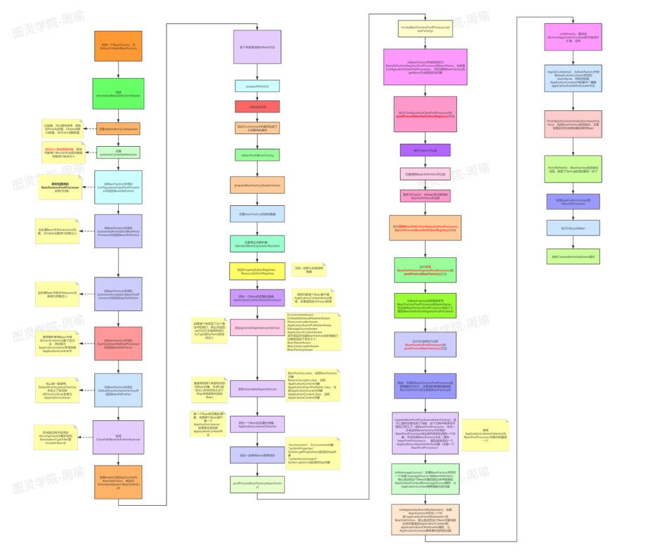
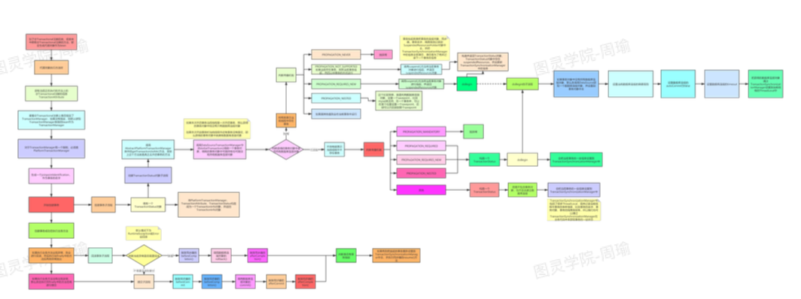
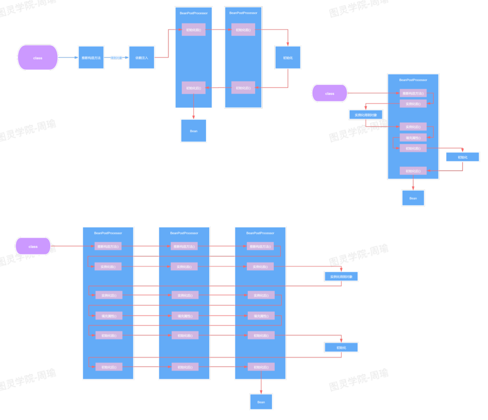
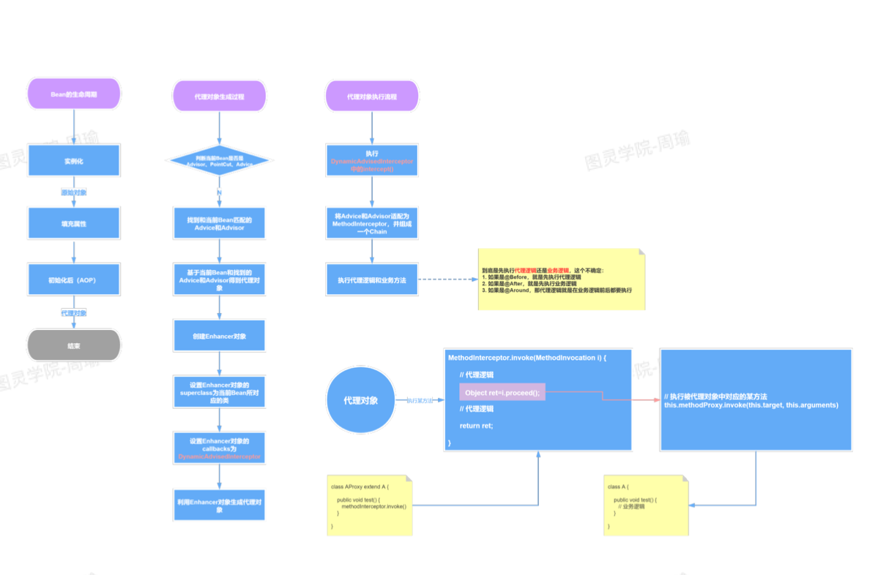
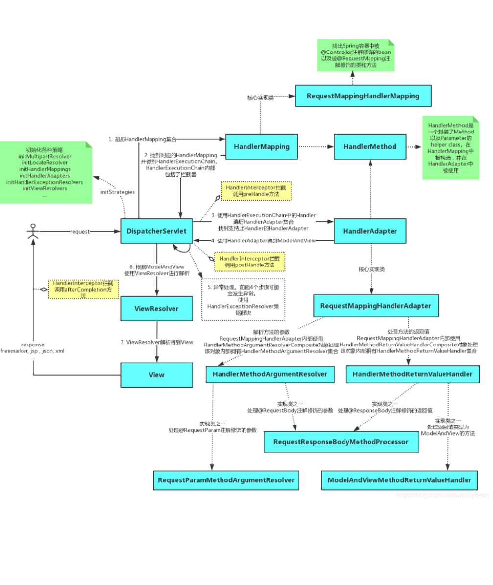
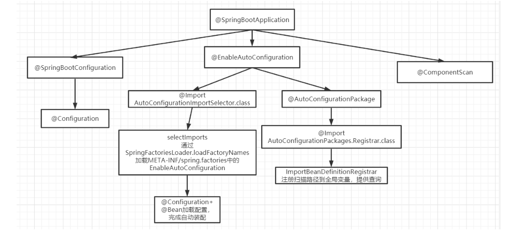

# spring

## Spring中Bean是线程安全的吗?

Spring本身并没有针对Bean做线程安全的处理，所以:

1. 如果Bean是无状态的，那么Bean则是线程安全的
2. 如果Bean是有状态的，那么Bean则不是线程安全的

另外，Bean是不是线程安全，跟Bean的作用域没有关系，Bean的作用域只是表示Bean的生命周期范围,对于任何生命周期的Bean都是一个对象，这个对象是不是线程安全的，还是得看这个Bean对象本身。


## 介绍一下Spring， 读过源码介绍一下大致流程

1. Spring是-个快速开发框架，Spring帮 助程序员来管理对象
2. Spring的源码实现的是非常优秀的，设计模式的应用、并发安全的实现、面向接口的设计等
3. 在创建Spring容器，也就是启动Spring时:
   - 首先会进行扫描，扫描得到所有的BeanDefinition对象，并存在一个Map中
   - 然后筛选出非懒加载的单例BeanDefinition进行创建Bean,对于多例Bean不需要在启动过程中去进行创建，对于多例Bean会在每次获取Bean时利用BeanDefinition去创建
   - 利用BeanDefinition创建Bean就是Bean的创建生命周期，这期间包括了合并BeanDefinition、推断构造方法、实例化、属性填充、初始化前、初始化、初始化后等步骤，其中AOP就是发生在初始化后这一步骤中
4. 单例Bean创建完了之后，Spring会发布一个容器启动事件
5. Spring启动结束
6. 在源码中会更复杂，比如源码中会提供一-些模板方法，让子类来实现，比如源码中还涉及到一些
   BeanFactoryPostProcessor和BeanPostProcessor的注册，Spring的扫描就 是通过
   BenaFactoryPostProcessor来实现的，依赖注入就是通过BeanPostProcessor来实现的
7. 在Spring启动过程中还会去处理@lmport等注解




## 说一下Spring的事务机制

1. Spring事务底层是基于数据库事务和AOP机制的
2. 首先对于使用了@Transactional注解的Bean，Spring会 创建一个代理对象作为Bean
3. 当调用代理对象的方法时，会先判断该方法.上是否加了@Transactional注解.
4. 如果加了，那么则利用事务管理器创建一个数据库连接
5. 并且修改数据库连接的autocommit属性为false，禁止此连接的自动提交，这是实现Spring事务非常重要的一步
6. 然后执行当前方法，方法中会执行sql 
7. 执行完当前方法后，如果没有出现异常就直接提交事务
8. 如果出现了异常，并且这个异常是需要回滚的就会回滚事务，否则仍然提交事务
9. Spring事务的隔离级别对应的就是数据库的隔离级别

10. Spring事务的传播机制是Spring事务自己实现的，也是Spring事务中最复杂的
11. Spring事务的传播机制是基于数据库连接来做的，一个数据库连接一个事务，如果传播机制配置为需要新开一个事务，那么实际上就是先建立一个数据库连接， 在此新数据库连接上执行sq|




## 什么时候@Transactional失效

因为Spring事务是基于代理来实现的，所以某个加了@Transactional的方法只有是被代理对象调用时（只有代理对象调用时才会生效，被代理对象调用时不会生效），那么这个注解才会生效，所以如果是被代理对象来调用这个方法，那么@Transactional是不会生效的。

同时如果某个方法是private的，那么@Transactional也会失效，因为底层cglib是基于父子类来实现的，子类是不能重载父类的private方法的，所以无法很好的利用代理，也会导致@Transactianal失效


## 如何实现一个IOC容器

1. 配置文件配置包扫描路径
2. 递归包扫描获取.class文件
3. 反射、确定需要交给IOC管理的类
4. 对需要注入的类进行依赖注入


- 配置文件中指定需要扫描的包路径 
- 定义一些注解，分别表示访问控制层、业务服务层、数据持久层、依赖注入注解、获取配置文件注 
- 从配置文件中获取需要扫描的包路径，获取到当前路径下的文件信息及文件夹信息，我们将当前路 径下所有以.class结尾的文件添加到一个Set集合中进行存储
- 遍历这个set集合，获取在类上有指定注解的类，并将其交给IOC容器，定义一个安全的Map用来 存储这些对象
- 遍历这个IOC容器，获取到每一个类的实例，判断里面是有有依赖其他的类的实例，然后进行递归 注入


## spring是什么?

轻量级的开源的J2EE框架。它是一个容器框架，用来装javabean(java对象)，中间层框架(万能胶) 可以起一个连接作用，比如说把Struts和hibernate粘合在一起运用，可以让我们的企业开发更快、更简 洁

Spring是一个轻量级的控制反转(IoC)和面向切面(AOP)的容器框架

- 从大小与开销两方面而言Spring都是轻量级的。
- 通过控制反转(IoC)的技术达到松耦合的目的
- 提供了面向切面编程的丰富支持，允许通过分离应用的业务逻辑与系统级服务进行内聚性的 

开发

- 包含并管理应用对象(Bean)的配置和生命周期，这个意义上是一个容器。
- 将简单的组件配置、组合成为复杂的应用，这个意义上是一个框架。


## Spring中后置处理器的作用

Spring中的后置处理器分为BeanFactory后置处理器和Bean后置处理器，它们是Spring底 层源码架构设计中非常重要的一种机制，同时开发者也可以利用这两种后置处理器来进行扩展。BeanFactory后置处理器表示针对BeanFactory的处理器，Spring启 动过程中，会先创建出BeanFactory实例，然后利用
BeanFactory处理器来加工BeanFactory,比如Spring的扫描就是基于BeanFactory后置处理器来实现
的，而Bean后置处理器也类似，Spring在 创建一个Bean的过程中， 首先会实例化得到一一个对象，然后再利用Bean后置处理器来对该实例对象进行加工，比如我们常说的依赖注入就是基于一个Bean后置处理器来实现的，通过该Bean后置处理器来给实例对象中加了@Autowired注解的属性自动赋值，还比如我们常说的AOP，也是利用一个Bean后置处理器来实现的，基于原实例对象，判断是否需要进行AOP，如果需要，那么就基于原实例对象进行动态代理，生成一个代理对象。




## 说说常用的SpringBoot注解，及其实现

1. @SpringBootApplication注解:这个注解标识了一个SpringBoot工程，它实际上是另外三个注解的组合，这三个注解是: 
   - @SpringBootConfiguration:这个注解实际就是-个@Configuration，表示启动类也是-个配
     置类
   - @EnableAutoConfiguration: 向Spring容 器中导入了一个Selector,用来加载ClassPath下
     SpringFactories中所定义的自动配置类，将这些自动加载为配置Bean
   - @ComponentScan:标识扫描路径，因为默认是没有配置实际扫描路径，所以SpringBoot扫描的路径是启动类所在的当前目录
2. @Bean注解:用来定义Bean，类似于XML中的<bean>标签，Spring在启动时，会对加了@Bean注解的方法进行解析，将方法的名字做为beanName，并通过执行方法得到bean对象
3. @Controller、@Service、 @ResponseBody、@ Autowired都可以说


## 谈谈你对AOP（面向切面编程）的理解

系统是由许多不同的组件所组成的，每一个组件各负责一块特定功能。除了实现自身核心功能之外，这些组件还经常承担着额外的职责。例如日志、事务管理和安全这样的核心服务经常融入到自身具有核心业务逻辑的组件中去。这些系统服务经常被称为横切关注点，因为它们会跨越系统的多个组件。

当我们需要为分散的对象引入公共行为的时候，OOP则显得无能为力。也就是说，OOP允许你定义从 上到下的关系，但并不适合定义从左到右的关系。例如日志功能。

日志代码往往水平地散布在所有对象层次中，而与它所散布到的对象的核心功能毫无关系。

 在OOP设计中，它导致了大量代码的重复，而不利于各个模块的重用。

AOP:将程序中的交叉业务逻辑(比如安全，日志，事务等)，封装成一个切面，然后注入到目标对象 (具体业务逻辑)中去。AOP可以对某个对象或某些对象的功能进行增强，比如对象中的方法进行增 强，可以在执行某个方法之前额外的做一些事情，在某个方法执行之后额外的做一些事情


## 如何实现AOP，项目哪些地方用到了AOP

利用动态代理技术来实现AOP，比如JDK动态代理或Cglib动态代理，利用动态代理技术，可以针对某个类生成代理对象，当调用代理对象的某个方法时，可以任意控制该方法的执行，比如可以先打印执行时间，再执行该方法，并且该方法执行完成后，再次打印执行时间。
项目中，比如事务、权限控制、方法执行时长日志都是通过AOP技术来实现的，凡是需要对某些方法做统一处理的都可以用AOP来实现，利用AOP可以做到业务无侵入。




## 谈谈你对IOC的理解

容器概念、控制反转、依赖注入

**ioc容器:**

实际上就是个map(key，value)，里面存的是各种对象(在xml里配置的bean节点、 @repository、@service、@controller、@component)，在项目启动的时候会读取配置文件里面的 bean节点，根据全限定类名使用反射创建对象放到map里、扫描到打上上述注解的类还是通过反射创 建对象放到map里。

这个时候map里就有各种对象了，接下来我们在代码里需要用到里面的对象时，再通过DI注入 (autowired、resource等注解，xml里bean节点内的ref属性，项目启动的时候会读取xml节点ref属性 根据id注入，也会扫描这些注解，根据类型或id注入;id就是对象名)。


**控制反转:** 

没有引入IOC容器之前，对象A依赖于对象B，那么对象A在初始化或者运行到某一点的时候，自己必须主动去创建对象B或者使用已经创建的对象B。无论是创建还是使用对象B，控制权都在自己手上。

引入IOC容器之后，对象A与对象B之间失去了直接联系，当对象A运行到需要对象B的时候，IOC容器会主动创建一个对象B注入到对象A需要的地方。（此时A和B都依赖于IOC容器）

通过前后的对比，不难看出来:对象A获得依赖对象B的过程,由主动行为变为了被动行为，控制权颠倒过来了，这就是“控制反转”这个名称的由来。

全部对象的控制权全部上缴给“第三方”IOC容器，所以，IOC容器成了整个系统的关键核心，它起到了一 种类似“粘合剂”的作用，把系统中的所有对象粘合在一起发挥作用，如果没有这个“粘合剂”，对象与对 象之间会彼此失去联系，这就是有人把IOC容器比喻成“粘合剂”的由来。


**依赖注入:**

“获得依赖对象的过程被反转了”。控制被反转之后，获得依赖对象的过程由自身管理变为了由IOC容器 主动注入。依赖注入是实现IOC的方法，就是由IOC容器在运行期间，动态地将某种依赖关系注入到对 象之中。


## BeanFactory和ApplicationContext有什么区别?

ApplicationContext是BeanFactory的子接口

ApplicationContext提供了更完整的功能:

1. 继承MessageSource，因此支持国际化。
2. 统一的资源文件访问方式。
3. 提供在监听器中注册bean的事件。
4. 同时加载多个配置文件。
5. 载入多个(有继承关系)上下文 ，使得每一个上下文都专注于一个特定的层次，比如应用的web层。


- BeanFactroy采用的是延迟加载形式来注入Bean的，即只有在使用到某个Bean时(调用 getBean())，才对该Bean进行加载实例化。这样，我们就不能发现一些存在的Spring的配置问 题。如果Bean的某一个属性没有注入，BeanFacotry加载后，直至第一次使用调用getBean方法 才会抛出异常。

- ApplicationContext，它是在容器启动时，一次性创建了所有的Bean。这样，在容器启动时，我 们就可以发现Spring中存在的配置错误，这样有利于检查所依赖属性是否注入。 

  ApplicationContext启动后预载入所有的单实例Bean，通过预载入单实例bean ,确保当你需要的 时候，你就不用等待，因为它们已经创建好了。

- 相对于基本的BeanFactory，ApplicationContext 唯一的不足是占用内存空间。当应用程序配置 Bean较多时，程序启动较慢。 

- BeanFactory通常以编程的方式被创建，ApplicationContext还能以声明的方式创建，如使用 ContextLoader。 

- BeanFactory和ApplicationContext都支持BeanPostProcessor、BeanFactoryPostProcessor的 使用，但两者之间的区别是:BeanFactory需要手动注册，而ApplicationContext则是自动注册。


## 描述一下Spring Bean的生命周期?

1. 解析类得到BeanDefinition
2. 如果有多个构造方法，则要推断构造方法
3. 确定好构造方法后，进行实例化得到一个对象 
4. 对对象中的加了@Autowired注解的属性进行属性填充 
5. 回调Aware方法，比如BeanNameAware，BeanFactoryAware
6. 调用BeanPostProcessor的初始化前的方法
7. 调用初始化方法
8. 调用BeanPostProcessor的初始化后的方法，在这里会进行AOP
9. 如果当前创建的bean是单例的则会把bean放入单例池
10. 使用bean
11. Spring容器关闭时调用DisposableBean中destory()方法


## 解释下Spring支持的几种bean的作用域。

- singleton:默认，每个容器中只有一个bean的实例，单例的模式由BeanFactory自身来维护。该对象的生命周期是与Spring IOC容器一致的(但在第一次被注入时才会创建)。
- prototype:为每一个bean请求提供一个实例。在每次注入时都会创建一个新的对象
- request:bean被定义为在每个HTTP请求中创建一个单例对象，也就是说在单个请求中都会复用 这一个单例对象。
- session:与request范围类似，确保每个session中有一个bean的实例，在session过期后，bean 会随之失效。（在request和session中的实例是单例的）
- application:bean被定义为在ServletContext的生命周期中复用一个单例对象。 
- websocket:bean被定义为在websocket的生命周期中复用一个单例对象。
- global-session:全局作用域，global-session和Portlet应用相关。当你的应用部署在Portlet容器 中工作时，它包含很多portlet。如果你想要声明让所有的portlet共用全局的存储变量的话，那么 这全局变量需要存储在global-session中。全局作用域与Servlet中的session作用域效果相同。


## Spring框架中的单例Bean是线程安全的么?

Spring中的Bean默认是单例模式的，框架并没有对bean进行多线程的封装处理。

如果Bean是有状态的 那就需要开发人员自己来进行线程安全的保证，最简单的办法就是改变bean的作 用域 把 "singleton"改为’‘protopyte’ 这样每次请求Bean就相当于是 new Bean() 这样就可以保证线程的 安全了。

- 有状态就是有数据存储功能
- 无状态就是不会保存数据 controller、service和dao层本身并不是线程安全的，只是如果只 是调用里面的方法，而且多线程调用一个实例的方法，会在内存中复制变量，这是自己的线程的工 作内存，是安全的。

Dao会操作数据库Connection，Connection是带有状态的，比如说数据库事务，Spring的事务管理器 使用Threadlocal为不同线程维护了一套独立的connection副本，保证线程之间不会互相影响(Spring 是如何保证事务获取同一个Connection的)

不要在bean中声明任何有状态的实例变量或类变量，如果必须如此，那么就使用ThreadLocal把变量变 为线程私有的，如果bean的实例变量或类变量需要在多个线程之间共享，那么就只能使用 synchronized、lock、CAS等这些实现线程同步的方法了。


## Spring框架中都用到了哪些设计模式?

- 简单工厂:由一个工厂类根据传入的参数，动态决定应该创建哪一个产品类。Spring中的BeanFactory就是简单工厂模式的体现，根据传入一个唯一的标识来获得Bean对象，但是否是 在传入参数后创建还是传入参数前创建这个要根据具体情况来定。

- 工厂方法:实现了FactoryBean接口的bean是一类叫做factory的bean。其特点是，spring会在使用getBean()调 用获得该bean时，会自动调用该bean的getObject()方法，所以返回的不是factory这个bean，而是这个 bean.getOjbect()方法的返回值。

- 单例模式:保证一个类仅有一个实例，并提供一个访问它的全局访问点。spring对单例的实现: spring中的单例模式完成了后半句话，即提供了全局的访问点BeanFactory。但没 有从构造器级别去控制单例，这是因为spring管理的是任意的java对象。

- 适配器模式:Spring定义了一个适配接口，使得每一种Controller有一种对应的适配器实现类，让适配器代替 controller执行相应的方法。这样在扩展Controller时，只需要增加一个适配器类就完成了SpringMVC 的扩展了。

- 装饰器模式:动态地给一个对象添加一些额外的职责。就增加功能来说，Decorator模式相比生成子类 更为灵活。Spring中用到的包装器模式在类名上有两种表现:一种是类名中含有Wrapper，另一种是类名中含有 Decorator。

- 动态代理:切面在应用运行的时刻被织入。一般情况下，在织入切面时，AOP容器会为目标对象创建动态的创建一个代理 对象。SpringAOP就是以这种方式织入切面的。

  ```
  织入:把切面应用到目标对象并创建新的代理对象的过程。
  ```

- 观察者模式:spring的事件驱动模型使用的是 观察者模式 ，Spring中Observer模式常用的地方是listener的实现。

- 策略模式:Spring框架的资源访问Resource接口。该接口提供了更强的资源访问能力，Spring 框架本身大量使用了 Resource 接口来访问底层资源。

- 模板方法:父类定义了骨架(调用哪些方法及顺序)，某些特定方法由子类实现。

  - 最大的好处:代码复用，减少重复代码。除了子类要实现的特定方法，其他方法及方法调用顺序都在父类中预先写好了。
  - refresh方法


## Spring事务的实现方式和原理以及隔离级别?

在使用Spring框架时，可以有两种使用事务的方式，一种是编程式的（自己写代码来控制事务），一种是申明式的，@Transactional注解就是申明式的。

首先，事务这个概念是数据库层面的，Spring只是基于数据库中的事务进行了扩展，以及提供了一些能让程序员更加方便操作事务的方式。

比如我们可以通过在某个方法上增加@Transactional注解，就可以开启事务，这个方法中所有的sql都 会在一个事务中执行，统一成功或失败。

在一个方法上加了@Transactional注解后，Spring会基于这个类生成一个代理对象，会将这个代理对象 作为bean，当在使用这个代理对象的方法时，如果这个方法上存在@Transactional注解，那么代理逻 辑会先把事务的自动提交设置为false，然后再去执行原本的业务逻辑方法，如果执行业务逻辑方法没有 出现异常，那么代理逻辑中就会将事务进行提交，如果执行业务逻辑方法出现了异常，那么则会将事务 进行回滚。

当然，针对哪些异常回滚事务是可以配置的，可以利用@Transactional注解中的rollbackFor属性进行 配置，默认情况下会对RuntimeException和Error进行回滚。

spring事务隔离级别就是数据库的隔离级别:外加一个默认级别

- read uncommitted(未提交读)
- read committed(提交读、不可重复读) 
- repeatable read(可重复读) 
- serializable(可串行化)

```
数据库的配置隔离级别是Read Commited,而Spring配置的隔离级别是Repeatable Read，请问这时隔离 级别是以哪一个为准? 以Spring配置的为准，如果spring设置的隔离级别数据库不支持，效果取决于数据库
```


## spring事务传播机制

多个事务方法相互调用时,事务如何在这些方法间传播

```
方法A是一个事务的方法，方法A执行过程中调用了方法B，那么方法B有无事务以及方法B对事务的要求不同都 会对方法A的事务具体执行造成影响，同时方法A的事务对方法B的事务执行也有影响，这种影响具体是什么就 由两个方法所定义的事务传播类型所决定。 								 				
```

REQUIRED(Spring默认的事务传播类型):如果当前没有事务，则自己新建一个事务，如果当前存在事 务，则加入这个事务

SUPPORTS:当前存在事务，则加入当前事务，如果当前没有事务，就以非事务方法执行 

MANDATORY:当前存在事务，则加入当前事务，如果当前事务不存在，则抛出异常。 

REQUIRES_NEW:创建一个新事务，如果存在当前事务，则挂起该事务。 

NOT_SUPPORTED:以非事务方式执行,如果当前存在事务，则挂起当前事务

NEVER:不使用事务，如果当前事务存在，则抛出异常 

NESTED:如果当前事务存在，则在嵌套事务中执行，否则REQUIRED的操作一样(开启一个事务)

```
和REQUIRES_NEW的区别 
REQUIRES_NEW是新建一个事务并且新开启的这个事务与原有事务无关，而NESTED则是当前存在事务时(我 们把当前事务称之为父事务)会开启一个嵌套事务(称之为一个子事务)。 在NESTED情况下父事务回滚时， 子事务也会回滚，而在REQUIRES_NEW情况下，原有事务回滚，不会影响新开启的事务。 	

和REQUIRED的区别 
REQUIRED情况下，调用方存在事务时，则被调用方和调用方使用同一事务，那么被调用方出现异常时，由于 共用一个事务，所以无论调用方是否catch其异常，事务都会回滚 而在NESTED情况下，被调用方发生异常 时，调用方可以catch其异常，这样只有子事务回滚，父事务不受影响 
```


## spring事务什么时候会失效？

spring事务的原理是AOP，进行了切面增强，那么失效的根本原因是这个AOP不起作用了!常见情况有如下几种

1. 发生自调用，类里面使用this调用本类的方法(this通常省略)，此时这个this对象不是代理类，而 是UserService对象本身!解决方法很简单，让那个this变成UserService的代理类即可!

2. 方法不是public的

   ```
   @Transactional 只能用于 public 的方法上，否则事务不会失效，如果要用在非 public 方法上，可 以开启 AspectJ 代理模式。
   ```

3. 数据库不支持事务

4. 没有被spring管理

5. 异常被吃掉，事务不会回滚(或者抛出的异常没有被定义，默认为RuntimeException)


## 什么是bean的自动装配，有哪些方式? 

开启自动装配，只需要在xml配置文件中定义“autowire”属性。

```
<bean id="cutomer" class="com.xxx.xxx.Customer" autowire="" />
```

autowire属性有五种装配的方式:

- no – 缺省情况下，自动配置是通过“ref”属性手动设定 。

  ```
  手动装配:以value或ref的方式明确指定属性值都是手动装配。 
  需要通过‘ref’属性来连接bean。
  ```

- byName-根据bean的属性名称进行自动装配。

  ```
  Cutomer的属性名称是person，Spring会将bean id为person的bean通过setter方法进行自动装 配。
  <bean id="cutomer" class="com.xxx.xxx.Cutomer" autowire="byName"/>
  <bean id="person" class="com.xxx.xxx.Person"/>
  ```

- byType-根据bean的类型进行自动装配。

  ```
  Cutomer的属性person的类型为Person，Spirng会将Person类型通过setter方法进行自动装配。 <bean id="cutomer" class="com.xxx.xxx.Cutomer" autowire="byType"/>
  <bean id="person" class="com.xxx.xxx.Person"/>
  ```

- constructor-类似byType，不过是应用于构造器的参数。如果一个bean与构造器参数的类型形 同，则进行自动装配，否则导致异常。

  ```
  Cutomer构造函数的参数person的类型为Person，Spirng会将Person类型通过构造方法进行自动装 配。
  <bean id="cutomer" class="com.xxx.xxx.Cutomer" autowire="construtor"/> <bean id="person" class="com.xxx.xxx.Person"/>
  ```

- autodetect-如果有默认的构造器，则通过constructor方式进行自动装配，否则使用byType方式 进行自动装配。

  ```
  如果有默认的构造器，则通过constructor方式进行自动装配，否则使用byType方式进行自动装配。
  ```

@Autowired自动装配bean，可以在字段、setter方法、构造函数上使用。


# springmvc、springBoot

## Spring Boot、Spring MVC和**Spring** 有什么区别

spring是一个IOC容器，用来管理Bean，使用依赖注入实现控制反转，可以很方便的整合各种框架，提 供AOP机制弥补OOP的代码重复问题、更方便将不同类不同方法中的共同处理抽取成切面、自动注入给 方法执行，比如日志、异常等

springmvc是spring对web框架的一个解决方案，提供了一个总的前端控制器Servlet，用来接收请求， 然后定义了一套路由策略(url到handle的映射)及适配执行handle，将handle结果使用视图解析技术 生成视图展现给前端

springboot是spring提供的一个快速开发工具包，让程序员能更方便、更快速的开发spring+springmvc 应用，简化了配置(约定了默认配置)，整合了一系列的解决方案(starter机制)、redis、 mongodb、es，可以开箱即用


## pringMVC 工作流程

> http://c.biancheng.net/spring_mvc/process.html

1. 用户发送请求至前端控制器 DispatcherServlet。 
2. DispatcherServlet 收到请求调用 HandlerMapping 处理器映射器。
3. 处理器映射器找到具体的处理器(可以根据 xml 配置、注解进行查找)，生成处理器及处理器拦截器 (如果有则生成)一并返回给 DispatcherServlet。
4. DispatcherServlet 调用 HandlerAdapter 处理器适配器。
5. HandlerAdapter 经过适配调用具体的处理器(Controller，也叫后端控制器)
6. Controller 执行完成返回 ModelAndView。
7. HandlerAdapter 将 controller 执行结果 ModelAndView 返回给 DispatcherServlet。
8. DispatcherServlet 将 ModelAndView 传给 ViewReslover 视图解析器。
9. ViewReslover 解析后返回具体 View。
10. DispatcherServlet 根据 View 进行渲染视图(即将模型数据填充至视图中)。
11. DispatcherServlet 响应用户。



## Spring MVC的主要组件?

Handler:也就是处理器。它直接应对着MVC中的C也就是Controller层，它的具体表现形式有很多，可 以是类，也可以是方法。在Controller层中@RequestMapping标注的所有方法都可以看成是一个 Handler，只要可以实际处理请求就可以是Handler

1. HandlerMapping initHandlerMappings(context)，处理器映射器，根据用户请求的资源uri来查找Handler的。在 SpringMVC中会有很多请求，每个请求都需要一个Handler处理，具体接收到一个请求之后使用哪个 Handler进行，这就是HandlerMapping需要做的事。

2. HandlerAdapter initHandlerAdapters(context)，适配器。因为SpringMVC中的Handler可以是任意的形式，只要能处 理请求就ok，但是Servlet需要的处理方法的结构却是固定的，都是以request和response为参数的方 法。如何让固定的Servlet处理方法调用灵活的Handler来进行处理呢?这就是HandlerAdapter要做的 事情。 
   Handler是用来干活的工具;HandlerMapping用于根据需要干的活找到相应的工具;HandlerAdapter 是使用工具干活的人。

3. HandlerExceptionResolver
   initHandlerExceptionResolvers(context)， 其它组件都是用来干活的。在干活的过程中难免会出现问 题，出问题后怎么办呢?这就需要有一个专门的角色对异常情况进行处理，在SpringMVC中就是 HandlerExceptionResolver。具体来说，此组件的作用是根据异常设置ModelAndView，之后再交给 render方法进行渲染。

4. ViewResolver 
   initViewResolvers(context)，ViewResolver用来将String类型的视图名和Locale解析为View类型的视 图。View是用来渲染页面的，也就是将程序返回的参数填入模板里，生成html(也可能是其它类型) 文件。这里就有两个关键问题:使用哪个模板?用什么技术(规则)填入参数?这其实是ViewResolver 主要要做的工作，ViewResolver需要找到渲染所用的模板和所用的技术(也就是视图的类型)进行渲 染，具体的渲染过程则交由不同的视图自己完成。

5. RequestToViewNameTranslator
   initRequestToViewNameTranslator(context)，ViewResolver是根据ViewName查找View，但有的 Handler处理完后并没有设置View也没有设置ViewName，这时就需要从request获取ViewName了， 如何从request中获取ViewName就是RequestToViewNameTranslator要做的事情了。 RequestToViewNameTranslator在Spring MVC容器里只可以配置一个，所以所有request到 ViewName的转换规则都要在一个Translator里面全部实现。

6. LocaleResolver
   initLocaleResolver(context)， 解析视图需要两个参数:一是视图名，另一个是Locale。视图名是处理 器返回的，Locale是从哪里来的?这就是LocaleResolver要做的事情。LocaleResolver用于从request 解析出Locale，Locale就是zh-cn之类，表示一个区域，有了这个就可以对不同区域的用户显示不同的 结果。SpringMVC主要有两个地方用到了Locale:一是ViewResolver视图解析的时候;二是用到国际化 资源或者主题的时候。

7. ThemeResolver 
   initThemeResolver(context)，用于解析主题。SpringMVC中一个主题对应一个properties文件，里面 存放着跟当前主题相关的所有资源、如图片、css样式等。SpringMVC的主题也支持国际化，同一个主 题不同区域也可以显示不同的风格。SpringMVC中跟主题相关的类有 ThemeResolver、ThemeSource 和Theme。主题是通过一系列资源来具体体现的，要得到一个主题的资源，首先要得到资源的名称，这 是ThemeResolver的工作。然后通过主题名称找到对应的主题(可以理解为一个配置)文件，这是 ThemeSource的工作。最后从主题中获取资源就可以了。

8. MultipartResolver 
   initMultipartResolver(context)，用于处理上传请求。处理方法是将普通的request包装成 MultipartHttpServletRequest，后者可以直接调用getFile方法获取File，如果上传多个文件，还可以调 用getFileMap得到FileName->File结构的Map。此组件中一共有三个方法，作用分别是判断是不是上传 请求，将request包装成MultipartHttpServletRequest、处理完后清理上传过程中产生的临时资源。

9. FlashMapManager 
   initFlashMapManager(context)，用来管理FlashMap的，FlashMap主要用在redirect中传递参数。

   

## Spring Boot 自动配置原理?

@Import + @Configuration + Spring spi

自动配置类由各个starter提供，使用@Configuration + @Bean定义配置类，放到META- INF/spring.factories下

使用Spring spi扫描META-INF/spring.factories下的配置类 

使用@Import导入自动配置类




## 如何理解Spring Boot中的Starter

使用spring + springmvc使用，如果需要引入mybatis等框架，需要到xml中定义mybatis需要的bean

starter就是定义一个starter的jar包，写一个@Configuration配置类、将这些bean定义在里面，然后在 starter包的META-INF/spring.factories中写入该配置类，springboot会按照约定来加载该配置类

开发人员只需要将相应的starter包依赖进应用，进行相应的属性配置(使用默认配置时，不需要配 置)，就可以直接进行代码开发，使用对应的功能了，比如mybatis-spring-boot--starter，spring- boot-starter-redis


## 什么是嵌入式服务器?为什么要使用嵌入式服务器？

节省了下载安装tomcat，应用也不需要再打war包，然后放到webapp目录下再运行

只需要一个安装了 Java 的虚拟机，就可以直接在上面部署应用程序了

springboot已经内置了tomcat.jar，运行main方法时会去启动tomcat，并利用tomcat的spi机制加载 springmvc