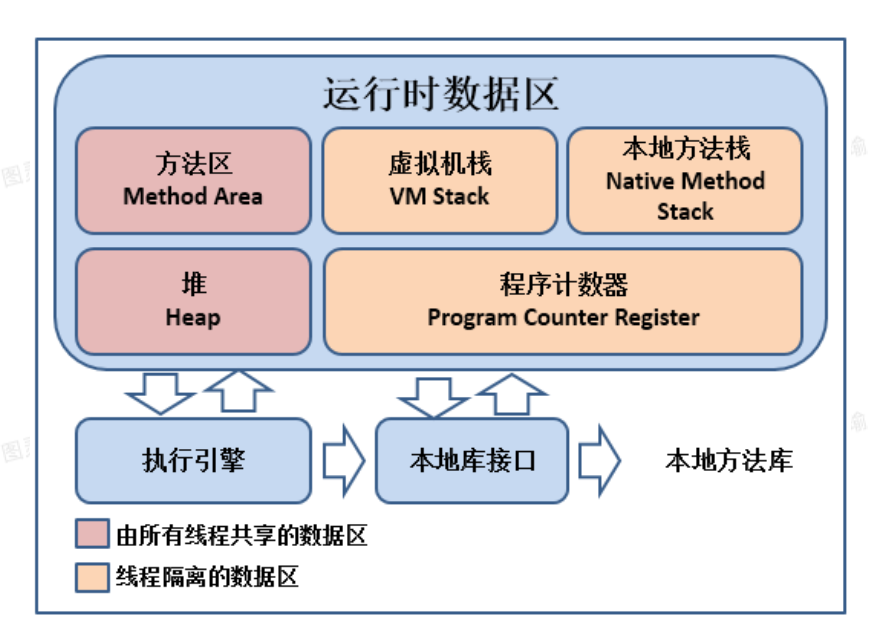
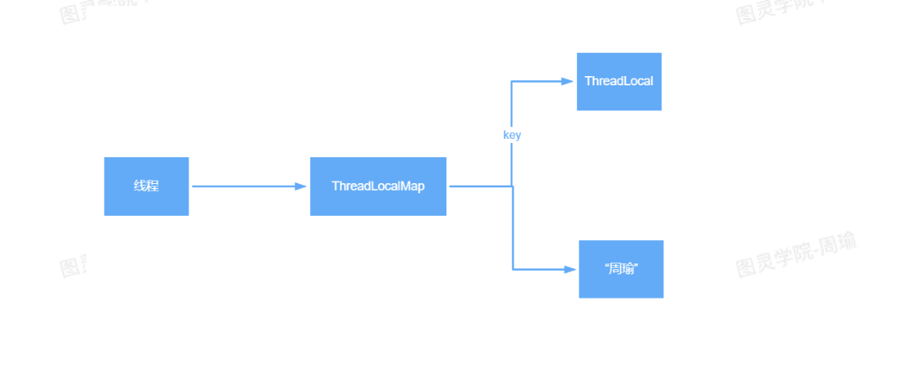
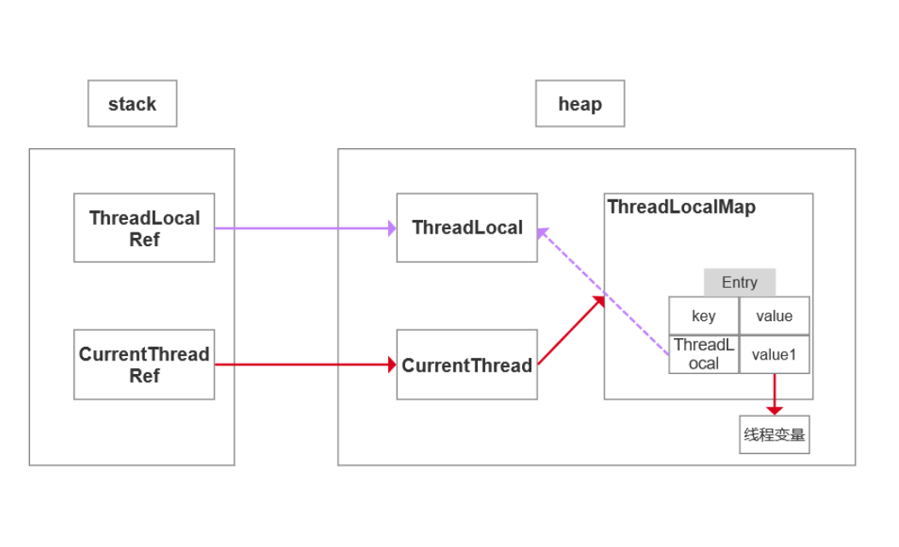
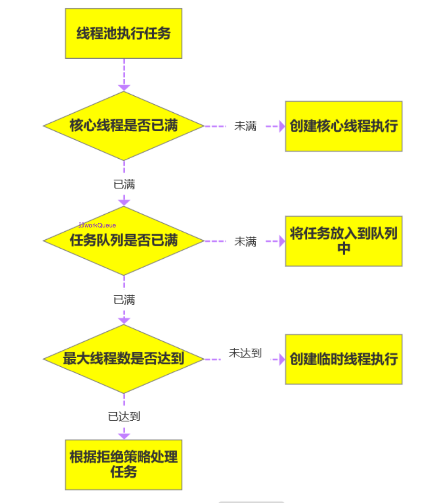

# Java基础

## 面向对象

什么是面向对象?

- 对比面向过程，是两种不同的处理问题的角度
- 面向过程更注重事情的每一个步骤及顺序，面向对象更注重事情有哪些参与者(对象)、及各自需要做什么


比如:洗衣机洗衣服 

面向过程会将任务拆解成一系列的步骤(函数)，1、打开洗衣机----->2、放衣服----->3、放洗衣粉--->4、清洗----->5、烘干 

面向对象会拆出人和洗衣机两个对象: 

- 人:打开洗衣机 放衣服 放洗衣粉 
- 洗衣机:清洗 烘干

从以上例子能看出，面向过程比较直接高效，而面向对象更易于复用、扩展和维护


面向对象

**封装**:封装的意义，在于明确标识出允许外部使用的所有成员函数和数据项

内部细节对外部调用透明，外部调用无需修改或者关心内部实现

1. javabean的属性私有，提供getset对外访问，因为属性的赋值或者获取逻辑只能由javabean本身决 定。而不能由外部胡乱修改

   ```java
   private String name;
   public void setName(String name){
       this.name = "tuling_"+name;
   }
   // 该name有自己的命名规则，明显不能由外部直接赋值
   ```

2. orm框架 操作数据库，我们不需要关心链接是如何建立的、sql是如何执行的，只需要引入mybatis，调方法即可

**继承**:继承基类的方法，并做出自己的改变和/或扩展。子类共性的方法或者属性直接使用父类的，而不需要自己再定义，只需扩展自己个性化的

**多态**:基于对象所属类的不同，外部对同一个方法的调用，实际执行的逻辑不同。 


继承，方法重写，父类引用指向子类对象

```java
父类类型 变量名 = new 子类对象 ; 
变量名.方法名(); // 调用的是子类的方法
```

无法调用子类特有的功能，即调用的方法必须在父类中也存在


## **JDK JRE JVM**


- JDK: Java Develpment Kit java 开发工具
- JRE: Java Runtime Environment java运行时环境
- JVM: java Virtual Machine java 虚拟机


## =和equals比较

-  ==对比的是栈中的值，基本数据类型是变量值，引用类型是堆中内存对象的地址
- equals:object中默认也是采用==比较，通常会重写
- 不做特殊处理的话==和equals差别不大

Object

```java
public boolean equals(Object obj) {
    return (this == obj);
}
```

String

```java
public boolean equals(Object anObject) {
    if (this == anObject) {
        return true;
    }
    if (anObject instanceof String) {
        String anotherString = (String)anObject;
        int n = value.length;
        if (n == anotherString.value.length) {
            char v1[] = value;
            char v2[] = anotherString.value;
            int i = 0;
            while (n-- != 0) {
                if (v1[i] != v2[i])
                    return false;
								i++; 
            }
            return true;
        }
}
    return false;
}
```

上述代码可以看出，String类中被复写的equals()方法其实是比较两个字符串的内容。

```java
public class StringDemo {
      public static void main(String args[]) {
            String str1 = "Hello";
            String str2 = new String("Hello");
            String str3 = str2; // 引用传递 
            System.out.println(str1 == str2); // false 
            System.out.println(str1 == str3); // false 
            System.out.println(str2 == str3); // true
        		System.out.println(str1.equals(str2)); // true
        		System.out.println(str1.equals(str3)); // true
        		System.out.println(str2.equals(str3)); // true
        } 
}
```


## hashCode与equals

hashCode介绍:

hashCode() 的作用是获取哈希码，也称为散列码;它实际上是返回一个int整数。这个哈希码的作用是 确定该对象在哈希表中的索引位置。hashCode() 定义在JDK的Object.java中，Java中的任何类都包含有 hashCode() 函数。 散列表存储的是键值对(key-value)，它的特点是:能根据“键”快速的检索出对应的“值”。这其中就利用 到了散列码!(可以快速找到所需要的对象)


为什么要有hashCode:

以**“HashSet如何检查重复”**为例子来说明为什么要有hashCode

对象加入HashSet时，HashSet会先计算对象的hashcode值来判断对象加入的位置，看该位置是否有 值，如果没有、HashSet会假设对象没有重复出现。但是如果发现有值，这时会调用equals()方法来 检查两个对象是否真的相同。如果两者相同，HashSet就不会让其加入操作成功。如果不同的话，就会 重新散列到其他位置。这样就大大减少了equals的次数，相应就大大提高了执行速度。

- 如果两个对象相等，则hashcode一定也是相同的 
- 两个对象相等,对两个对象分别调用equals方法都返回true 
- 两个对象有相同的hashcode值，它们也不一定是相等的 
- 因此，equals方法被覆盖过，则hashCode方法也必须被覆盖 
- hashCode()的默认行为是对堆上的对象产生独特值。如果没有重写hashCode()，则该class的两个 对象无论如何都不会相等(即使这两个对象指向相同的数据)


## **final**

最终的

-  修饰类:表示类不可被继承
-  修饰方法:表示方法不可被子类覆盖，但是可以重载
-  修饰变量:表示变量一旦被赋值就不可以更改它的值。

1. 修饰成员变量

   - 如果final修饰的是类变量，只能在静态初始化块中指定初始值或者声明该类变量时指定初始值。
   - 如果final修饰的是成员变量，可以在非静态初始化块、声明该变量或者构造器中执行初始值。 

2. 修饰局部变量

   系统不会为局部变量进行初始化，局部变量必须由程序员显示初始化。因此使用final修饰局部变量时， 即可以在定义时指定默认值(后面的代码不能对变量再赋值)，也可以不指定默认值，而在后面的代码 中对final变量赋初值(仅一次)

   ```java
   public class FinalVar {
   	final static int a = 0;//再声明的时候就需要赋值 或者静态代码块赋值 
     /**
   	static{
   	a = 0; }
   	*/
   	final int b = 0;//再声明的时候就需要赋值 或者代码块中赋值 或者构造器赋值
     /*{
     b = 0;
     }*/
     public static void main(String[] args) {
       final int localA; //局部变量只声明没有初始化，不会报错,与final无关。 
       localA = 0;//在使用之前一定要赋值
       //localA = 1; 但是不允许第二次赋值
     } 
   }
   ```

3. 修饰基本类型数据和引用类型数据

   - 如果是基本数据类型的变量，则其数值一旦在初始化之后便不能更改

   - 如果是引用类型的变量，则在对其初始化之后便不能再让其指向另一个对象。**但是引用的值是可变 的**。

     ```java
     public class FinalReferenceTest{
         public static void main(){
     			final int[] iArr={1,2,3,4}; 
           iArr[2]=-3;//合法 iArr=null;//非法，对iArr不能重新赋值
     			final Person p = new Person(25); 
           p.setAge(24);//合法
     			p=null;//非法
         }
     }
     ```

4. **为什么局部内部类和匿名内部类只能访问局部final变量?**

   编译之后会生成两个class文件，Test.class Test1.class

   ```java
   public class Test {
     public static void main(String[] args) {
     }
     //局部final变量a,b
     public void test(final int b) {//jdk8在这里做了优化, 不用写,语法糖，但实际上也是有
     的，也不能修改
       final int a = 10; //匿名内部类
       new Thread(){
           public void run() {
               System.out.println(a);
               System.out.println(b);
           };
       }.start();
     }
   }
   class OutClass {
        private int age = 12;
        public void outPrint(final int x) {
            class InClass {
                 public void InPrint() {
                     System.out.println(x);
     								System.out.println(age);
                 } 
            }
     			new InClass().InPrint();
        }
   }
   ```

   首先需要知道的一点是: 内部类和外部类是处于同一个级别的，内部类不会因为定义在方法中就会随着 方法的执行完毕就被销毁。

   这里就会产生问题:当外部类的方法结束时，局部变量就会被销毁了，但是内部类对象可能还存在(只有 没有人再引用它时，才会死亡)。这里就出现了一个矛盾:内部类对象访问了一个不存在的变量。为了解 决这个问题，就将局部变量复制了一份作为内部类的成员变量，这样当局部变量死亡后，内部类仍可以 访问它，实际访问的是局部变量的"copy"。这样就好像延长了局部变量的生命周期

   将局部变量复制为内部类的成员变量时，必须保证这两个变量是一样的，也就是如果我们在内部类中修改了成员变量，方法中的局部变量也得跟着改变，怎么解决问题呢?

   就将局部变量设置为final，对它初始化后，我就不让你再去修改这个变量，就保证了内部类的成员变量 和方法的局部变量的一致性。这实际上也是一种妥协。使得局部变量与内部类内建立的拷贝保持一致。


## String、StringBuffer、StringBuilder

1. String是final修饰的，不可变，每次操作都会产生新的String对象 
2. StringBuffer和StringBuilder都是在原对象上操作 
3. StringBuffer是线程安全的，StringBuilder线程不安全的（多线程环境下使用共享变量，要保证结果的正确性的情况下。若要额外加锁，就是线程不安全的，否则就是安全的。StringBuffer的方法都是synchronized修饰的，不需要额外加锁，因此是线程安全的。）
4. StringBuffer方法都是synchronized修饰的
5. 性能:StringBuilder > StringBuffer > String 


场景:经常需要改变字符串内容时使用后面两个

优先使用StringBuilder，多线程使用共享变量时使用StringBuffer


## **重载和重写的区别**

**重载:** 发生在同一个类中，方法名必须相同，参数类型不同、个数不同、顺序不同，方法返回值和访问 修饰符可以不同，发生在编译时。

**重写:** 发生在父子类中，方法名、参数列表必须相同，返回值范围小于等于父类，抛出的异常范围小于 等于父类，访问修饰符范围大于等于父类;如果父类方法访问修饰符为private则子类就不能重写该方 法。

```java
public int add(int a,String b) 
public String add(int a,String b) //编译报错
```


## **接口和抽象类的区别**

抽象类可以存在普通成员函数，而接口中只能存在public abstract 方法。 抽象类中的成员变量可以是各种类型的，而接口中的成员变量只能是public static final类型的。 抽象类只能继承一个，接口可以实现多个。

接口的设计目的，是对类的行为进行约束(更准确的说是一种“有”约束，因为接口不能规定类不可以有 什么行为)，也就是提供一种机制，可以强制要求不同的类具有相同的行为。它只约束了行为的有无， 但不对如何实现行为进行限制。

而抽象类的设计目的，是代码复用。当不同的类具有某些相同的行为(记为行为集合A)，且其中一部分行 为的实现方式一致时(A的非真子集，记为B)，可以让这些类都派生于一个抽象类。在这个抽象类中实 现了B，避免让所有的子类来实现B，这就达到了代码复用的目的。而A减B的部分，留给各个子类自己 实现。正是因为A-B在这里没有实现，所以抽象类不允许实例化出来(否则当调用到A-B时，无法执 行)。

抽象类是对类本质的抽象，表达的是 is a 的关系，比如: BMW is a Car 。抽象类包含并实现子类的通 用特性，将子类存在差异化的特性进行抽象，交由子类去实现。

而接口是对行为的抽象，表达的是 like a 的关系。比如: Bird like a Aircraft (像飞行器一样可以 飞)，但其本质上 is a Bird 。接口的核心是定义行为，即实现类可以做什么，至于实现类主体是谁、 是如何实现的，接口并不关心。

使用场景:当你关注一个事物的本质的时候，用抽象类;当你关注一个操作的时候，用接口。

抽象类的功能要远超过接口，但是，定义抽象类的代价高。因为高级语言来说(从实际设计上来说也是)每个类只能继承一个类。在这个类中，你必须继承或编写出其所有子类的所有共性。虽然接口在功能上会弱化许多，但是它只是针对一个动作的描述。而且你可以在一个类中同时实现多个接口。在设计
阶段会降低难度


## **List和Set的区别**

- List:有序，按对象进入的顺序保存对象，可重复，允许多个Null元素对象，可以使用Iterator取出 所有元素，在逐一遍历，还可以使用get(int index)获取指定下标的元素 
- Set:无序，不可重复，最多允许有一个Null元素对象，取元素时只能用Iterator接口取得所有元 素，在逐一遍历各个元素


## ArrayList和LinkedLis区别

ArrayList:基于动态数组，连续内存存储，适合下标访问(随机访问)，扩容机制:因为数组长度固 定，超出长度存数据时需要新建数组，然后将老数组的数据拷贝到新数组，如果不是尾部插入数据还会 涉及到元素的移动(往后复制一份，插入新元素)，使用尾插法并指定初始容量可以极大提升性能、甚 至超过linkedList(需要创建大量的node对象)

LinkedList:基于链表，可以存储在分散的内存中，适合做数据插入及删除操作，不适合查询:需要逐 一遍历

遍历LinkedList必须使用iterator不能使用for循环，因为每次for循环体内通过get(i)取得某一元素时都需 要对list重新进行遍历，性能消耗极大。 另外不要试图使用indexOf等返回元素索引，并利用其进行遍历，使用indexlOf对list进行了遍历，当结 果为空时会遍历整个列表。


## HashMap和HashTable有什么区别?其底层实现是什 么?

区别 :

1. HashMap方法没有synchronized修饰，线程非安全，HashTable线程安全; 
2. HashMap允许key和value为null，而HashTable不允许


底层实现：数组+链表实现 

jdk8开始链表高度到8、数组长度超过64，链表转变为红黑树，元素以内部类Node节点存在

- 计算key的hash值，二次hash然后对数组长度取模，对应到数组下标， 
- 如果没有产生hash冲突(下标位置没有元素)，则直接创建Node存入数组，
-  如果产生hash冲突，先进行equal比较，相同则取代该元素，不同，则判断链表高度插入链表，链 表高度达到8，并且数组长度到64则转变为红黑树，长度低于6则将红黑树转回链表 
- key为null，存在下标0的位置
- 相同则取代该元素：key值相同，将value取代

数组扩容


## ConcurrentHashMap原理，jdk7和jdk8版本的区别

 **jdk7:**

数据结构:ReentrantLock+Segment+HashEntry，一个Segment中包含一个HashEntry数组，每个 HashEntry又是一个链表结构

元素查询:二次hash，第一次Hash定位到Segment，第二次Hash定位到元素所在的链表的头部 

锁:Segment分段锁 Segment继承了ReentrantLock，锁定操作的Segment，其他的Segment不受影响，并发度为segment个数，可以通过构造函数指定，数组扩容不会影响其他的segment（ConcurrentHashMap计算出key在哪一个段中，然后只锁定这一个段，其他段不受影响，因此是分段锁。锁的粒度更小。segment有多少个，就代表可以同时有多少个线程并发操作。）

get方法无需加锁，volatile保证

**jdk8:**

数据结构:synchronized+CAS+Node+红黑树，Node的val和next都用volatile修饰，保证可见性

查找，替换，赋值操作都使用CAS

锁:锁链表的head节点，不影响其他元素的读写，锁粒度更细，效率更高，扩容时，阻塞所有的读写 操作、并发扩容

读操作无锁: 

- Node的val和next使用volatile修饰，读写线程对该变量互相可见 
- 数组用volatile修饰，保证扩容时被读线程感知


## 什么是字节码?采用字节码的好处是什么?

 **java中的编译器和解释器:**

Java中引入了虚拟机的概念，即在机器和编译程序之间加入了一层抽象的虚拟的机器。这台虚拟的机器 在任何平台上都提供给编译程序一个的共同的接口。 

编译程序只需要面向虚拟机，生成虚拟机能够理解的代码，然后由解释器来将虚拟机代码转换为特定系 统的机器码执行。在Java中，这种供虚拟机理解的代码叫做 字节码(即扩展名为 .class的文件)，它不 面向任何特定的处理器，只面向虚拟机。

每一种平台的解释器是不同的，但是实现的虚拟机是相同的。Java源程序经过编译器编译后变成字节 码，字节码由虚拟机解释执行，虚拟机将每一条要执行的字节码送给解释器，解释器将其翻译成特定机 器上的机器码，然后在特定的机器上运行。这也就是解释了Java的编译与解释并存的特点。 Java源代码---->编译器---->jvm可执行的Java字节码(即虚拟指令)---->jvm---->jvm中解释器----->机器可执 行的二进制机器码---->程序运行。

**采用字节码的好处:**

Java语言通过字节码的方式，在一定程度上解决了传统解释型语言执行效率低的问题，同时又保留了解 释型语言可移植的特点。所以Java程序运行时比较高效，而且，由于字节码并不专对一种特定的机器， 因此，Java程序无须重新编译便可在多种不同的计算机上运行。


## Java中的异常体系

Java中的所有异常都来自顶级父类Throwable。

Throwable下有两个子类Exception和Error。 

Error是程序无法处理的错误，一旦出现这个错误，则程序将被迫停止运行。

Exception不会导致程序停止，又分为两个部分RunTimeException运行时异常和CheckedException检 查异常。 

RunTimeException常常发生在程序运行过程中，会导致程序当前线程执行失败。CheckedException常 常发生在程序编译过程中，会导致程序编译不通过。


## 泛型中extends和super的区别

1. <? extends T>表示包括T在内的任何T的子类
2. <? super T>表示包括T在内的任何T的父类


## Java类加载器

JDK自带有三个类加载器:bootstrap ClassLoader、ExtClassLoader、AppClassLoader。 

BootStrapClassLoader是ExtClassLoader的父类加载器，默认负责加载%JAVA_HOME%lib下的jar包和 class文件。 

ExtClassLoader是AppClassLoader的父类加载器，负责加载%JAVA_HOME%/lib/ext文件夹下的jar包和 class类。 

AppClassLoader是自定义类加载器的父类，负责加载classpath下的类文件（程序猿编写的代码、引入的jar包等）。系统类加载器，线程上下 文加载器

继承ClassLoader实现自定义类加载器


## **双亲委托模型**


双亲委派模型的好处:

主要是为了安全性，避免用户自己编写的类动态替换 Java的一些核心类，比如 String。 同时也避免了类的重复加载，因为 JVM中区分不同类，不仅仅是根据类名，相同的 class文件被不 同的 ClassLoader加载就是不同的两个类


**另一种解释**

JVM中存在三个默认的类加载器:

1. BootstrapClassLoader

2. ExtClassLoader

3. AppClassLoader

AppClassL oader的父加载器是ExtClassl oader，ExtClassL oader的父加载器是
BootstrapClassL oader。

JVM在加载一个类时，会调用AppClassLoader的loadClass方法来加载这个类，不过在这个方法中， 会先使用ExtClassL oader的loadClass方法来加载类，同样ExtClassL oader的loadClass方法中会先使用
BootstrapClassLoader来加载类，如果BootstrapClassL oader加载到了就直接成功，如果
BootstrapClassL oader没有加载到，那么ExtClassLoader就会自己尝试加载该类，如果没有加载到，那么则会由AppClassLoader来加载这个类。

所以，双亲委派指得是，JVM在加载类时，会委派给Ext和Bootstrap进行加载，如果没加载到才由自己进行加载。


## GC如何判断对象可以被回收

- 引用计数法:每个对象有一个引用计数属性，新增一个引用时计数加1，引用释放时计数减1，计 数为0时可以回收，
- 可达性分析法:从 GC Roots 开始向下搜索，搜索所走过的路径称为引用链。当一个对象到 GC Roots 没有任何引用链相连时，则证明此对象是不可用的，那么虚拟机就判断是可回收对象。

> 引用计数法，可能会出现A 引用了 B，B 又引用了 A，这时候就算他们都不再使用了，但因为相互 引用 计数器=1 永远无法被回收。

GC Roots的对象有:

- 虚拟机栈(栈帧中的本地变量表)中引用的对象 
- 方法区中类静态属性引用的对象 
- 方法区中常量引用的对象 
- 本地方法栈中JNI(即一般说的Native方法)引用的对象

可达性算法中的不可达对象并不是立即死亡的，对象拥有一次自我拯救的机会。对象被系统宣告死亡至 少要经历两次标记过程:第一次是经过可达性分析发现没有与GC Roots相连接的引用链，第二次是在由 虚拟机自动建立的Finalizer队列中判断是否需要执行finalize()方法。

当对象变成(GC Roots)不可达时，GC会判断该对象是否覆盖了finalize方法，若未覆盖，则直接将其回 收。否则，若对象未执行过finalize方法，将其放入F-Queue队列，由一低优先级线程执行该队列中对象 的finalize方法。执行finalize方法完毕后，GC会再次判断该对象是否可达，若不可达，则进行回收，否 则，对象“复活”

每个对象只能触发一次finalize()方法 

由于finalize()方法运行代价高昂，不确定性大，无法保证各个对象的调用顺序，不推荐大家使用，建议遗忘它。


## 说一下ArrayList和LinkedList区别

1. 首先，他们的底层数据结构不同，ArrayList底层是基于数组实现的，LinkedList底层是基于链表实现的
2. 由于底层数据结构不同，他们所适用的场景也不同，ArrayList更适合随机查找，LinkedList更适合删除和添加，查询、添加、删除的时间复杂度不同
3. 另外ArrayList和LinkedList都实现了List接口，但是LinkedList还额外实现了Deque接口，所以
   LinkedList还可以当做队列来使用.


## 说一下HashMap的Put方法

先说HashMap的Put方法的大体流程:

1. 根据Key通过哈希算法与与运算得出数组下标
2. 如果数组下标位置元素为空，则将key和value封装为Entry对象(JDK1.7中 是Entry对象，JDK1.8中是Node对象)并放入该位置
3. 如果数组下标位置元素不为空，则要分情况讨论
   - 如果是JDK1.7，则先判断是否需要扩容，如果要扩容就进行扩容，如果不用扩容就生成Entry对象，并使用头插法添加到当前位置的链表中
   - 如果是JDK1.8，则会先判断当前位置上的Node的类型，看是红黑树Node,还是链表Node
     - 如果是红黑树Node，则将key和value封装为一个红黑树节点并添加到红黑树中去，在这个过程中会判断红黑树中是否存在当前key,如果存在则更新value:
     - 如果此位置上的Node对象是链表节点，则将key和value封装为一 个链表Node并通过尾插法插入到链表的最后位置去，因为是尾插法，所以需要遍历链表，在遍历链表的过程中会判断是否存在当前key,如果存在则更新value，当遍历完链表后，将新链表Node插入到链表中，插入到链表后，会看当前链表的节点个数，如果大于等于8，那么则会将该链表转成红黑树
     - 将key和value封装为Node插入到链表或红黑树中后，再判断是否需要进行扩容，如果需要就扩容，如果不需要就结束PUT方法


## 说一下JVM中，哪些是共享区，哪些可以作为gc root

1. 堆区和方法区是所有线程共享的，栈、本地方法栈、程序计数器是每个线程独有的

   

2. 什么是gc root, JVM在进行垃圾回收时，需要找到“垃圾”对象，也就是没有被引用的对象，但是直接
   找“垃圾”对象是比较耗时的，所以反过来，先找“非垃圾”对象，也就是正常对象，那么就需要从某
   些“根”开始去找，根据这些“根”的引用路径找到正常对象，而这些“根”有一个特征，就是它只会引用其他对象，而不会被其他对象引用，例如:栈中的本地变量、方法区中的静态变量、本地方法栈中的变量、正在运行的线程等可以作为gc root。


## 你们项目如何排查JVM问题

对于还在正常运行的系统:（通过一些指令或工具来监控正常运行的系统）

1. 可以使用jmap来查看JVM中各个区域的使用情况
2. 可以通过jstack来查看线程的运行情况，比如哪些线程阻塞、是否出现了死锁
3. 可以通过jstat命令来查看垃圾回收的情况，特别是fullgc，如果发现fullgc比较频繁，那么就得进行调优了
4. 通过各个命令的结果，或者jvisualvm等工具来进行分析
5. 首先，初步猜测频繁发送fullgc的原因，如果频繁发生fullgc但是又-直没有出现内存溢出，那么表示fullgc实际上是回收了很多对象了，所以这些对象最好能在younggc过程中就直接回收掉，避免这些对象进入到老年代，对于这种情况，就要考虑这些存活时间不长的对象是不是比较大，导致年轻代放不下，直接进入到了老年代，尝试加大年轻代的大小，如果改完之后，fullgc减少， 则证明修改有效
6. 同时，还可以找到占用CPU最多的线程，定位到具体的方法，优化这个方法的执行，看是否能避免某些对象的创建，从而节省内存


对于已经发生了OOM（out of memory内存溢出）的系统:

1. 一般生产系统中都会设置当系统发生了OOM时，生成当时的dump文件(-
   XX:+HeapDumpOnOutOfMemoryError -XX:HeapDumpPath=/usr/local/base)
2. 我们可以利用jsisualvm等工具来分析dump文件
3. 根据dump文件找到异常的实例对象，和异常的线程(占用CPU高)，定位到具体的代码
4. 然后再进行详细的分析和调试


总之，调优不是一蹴而就的，需要分析、推理、实践、总结、再分析，最终定位到具体的问题。


## Jdk1.7到Jdk1.8 HashMap发生了什么变化(底层)?

1. 1.7中底层是数组+链表，1.8中底层是数组+链表+红黑树，加红黑树的目的是提高HashMap插入和查询整体效率
2. 1.7中链表插入使用的是头插法，1.8中链表插入使用的是尾插法，因为1.8中插入key和value时需要判断链表元素个数，所以需要遍历链表统计链表元素个数，所以正好就直接使用尾插法
3. 1.7中哈希算法比较复杂，存在各种右移与异或运算，1.8中进行了 简化，因为复杂的哈希算法的目的就是提高散列性，来提供HashMap的整体效率，而1.8中新增了红黑树，所以可以适当的简化哈希算法,节省CPU资源


## Jdk1.7到Jdk1.8 java 虚拟机发生了什么变化?

1.7中存在永久代，1.8中没有永久代，替换它的是元空间，元空间所占的内存不是在虚拟机内部，而是本地内存空间，这么做的原因是，不管是永久代还是元空间，他们都是方法区的具体实现，之所以元空间所占的内存改成本地内存，官方的说法是为了和JRockit统一，不过额外还有一些原因，比如方法区所存储的类信息通常是比较难确定的，所以对于方法区的大小是比较难指定的，太小了容易出现方法区溢出，太大了又会占用了太多虚拟机的内存空间，而转移到本地内存后则不会影响虚拟机所占用的内存


## 深拷贝和浅拷贝

深拷贝和浅拷贝就是指对象的拷贝，一个对象中存在两种类型的属性，-种是基本数据类型，一种是实例对象的引用。

1. 浅拷贝是指，只会拷贝基本数据类型的值，以及实例对象的引用地址，并不会复制一份引用地址所指向的对象，也就是浅拷贝出来的对象，内部的类属性指向的是同一个对象
2. 深拷贝是指，既会拷贝基本数据类型的值，也会针对实例对象的引用地址所指向的对象进行复制，深拷贝出来的对象，内部的属性指向的不是同一个对象


## 谈谈ConcurrentHashMap的扩容机制

1.7版本

1. 1.7版本的ConcurrentHashMap是基于Segment分段实现的
2. 每个Segment相对于一个小型的HashMap
3. 每个Segment内部会进行扩容，和HashMap的扩 容逻辑类似
4. 先生成新的数组，然后转移元素到新数组中
5. 扩容的判断也是每个Segment内部单独判断的，判断是否超过阈值

1.8版本

1. 1.8版本的ConcurrentHashMap不再基于Segment实现
2. 当某个线程进行put时，如果发现ConcurrentHashMap正在进行扩容那么该线程. -起进行扩容
3. 如果某个线程put时，发现没有正在进行扩容，则将key-value添 加到ConcurrentHashMap中，然后判断是否超过阈值，超过了则进行扩容
4. ConcurrentHashMap是支持多个线程同时扩容的
5. 扩容之前也先生成-个新的数组
6. 在转移元素时，先将原数组分组，将每组分给不同的线程来进行元素的转移，每个线程负责-组或多组.的元素转移工作


## TCP的三次握手和四次挥手

TCP协议是7层网络协议中的传输层协议，负责数据的可靠传输。

在建立TCP连接时，需要通过三次握手来建立,过程是:

1. 客户端向服务端发送一个SYN
2. 服务端接收到SYN后，给客户端发送-个SYN_ ACK
3. 客户端接收到SYN_ _ACK后，再给服务端发送一个ACK


在断开TCP连接时，需要通过四次挥手来断开，过程是:

1. 客户端向服务端发送FIN
2. 服务端接收FIN后，向客户端发送ACK，表示我接收到了断开连接的请求，客户端你可以不发数据了，不过服务端这边可能还有数据正在处理
3. 服务端处理完所有数据后，向客户端发送FIN，表示服务端现在可以断开连接
4. 客户端收到服务端的FIN,向服务端发送ACK,表示客户端也会断开连接了


## 二叉搜索树和平衡二叉树有什么关系?

平衡二叉树也叫做平衡二叉搜索树，是二叉搜索树的升级版，二叉搜索树是指节点左边的所有节点都比该节点小，节点右边的节点都比该节点大，而平衡二叉搜索树是在二叉搜索的基础上还规定了节点左右两边的子树高度差的绝对值不能超过1


## 强平衡二叉树和弱平衡二叉树有什么区别

[教学](https://blog.csdn.net/u010899985/article/details/80981053?spm=1001.2101.3001.6650.1&utm_medium=distribute.pc_relevant.none-task-blog-2%7Edefault%7EBlogCommendFromBaidu%7Edefault-1.pc_relevant_default&depth_1-utm_source=distribute.pc_relevant.none-task-blog-2%7Edefault%7EBlogCommendFromBaidu%7Edefault-1.pc_relevant_default&utm_relevant_index=2)

强平衡二叉树AVL树，弱平衡二叉树就是我们说的红黑树。

1. AVL树比红黑树对于平衡的程度更加严格，在相同节点的情况下，AVL树的高度低于红黑树
2. 红黑树中增加了一个节点颜色的概念
3. AVL树的旋转操作比红黑树的旋转操作更耗时


## epoll和poll的区别

1. select模型，使用的是数组来存储Socket连接文件描述符，容量是固定的，需要通过轮询来判断是否发生了IO事件
2. poll模型，使用的是链表来存储Socket连接文件描述符，容量是不固定的，同样需要通过轮询来判断是否发生了IO事件
3. epolI模型，epoll和poll是完全不同的，epoll是一种事件通知模型，当发生了IO事件时，应用程序才进行IO操作，不需要像polI模型那样主动去轮询


## HTTPS是如何保证安全传输的

https通过使用对称加密、非对称加密、数字证书等方式来保证数据的安全传输。

1. 客户端向服务端发送数据之前，需要先建立TCP连接。所以需要先建立TCP连接。建立完TCP连接后，服务端会先给客户端发送公钥，客户端拿到公钥后就可以用来加密数据了，服务端到时候接收到数据就可以用私钥解密数据，这种就是通过非对称加密来传输数据
2. 不过非对称加密比对称加密要慢，所以不能直接使用非对称加密来传输请求数据，所以可以通过非对称加密的方式来传输对称加密的秘钥。之后就可以使用对称加密来传输请求数据了
3. 但是仅仅通过非对称加密+对称加密还不足以能保证数据传输的绝对安全，因为服务端向客户端发送公钥时，可能会被截取
4. 所以为了安全的传输公钥，需要用到数字证书，数字证书是具有公信力、大家部认可的，服务鏰向客户端发送公钥时，可以把公钥和服务端相关信息通过Hash算法生成消息摘要，再通过数宇证书提供的私钥对消息摘要进行加密生成数字签名，在把没进行Hash算法之前的信息和数字签名-起形成数字证书。最后把数字证书发送结客户端。 客户端收到数字证书后。就会通过数字证书提供的公钥来解密数字证书，从而得到非对称加密要用到的公钥。
5. 在这个过程中，就算有中间人拦截到服务端发出来的数字证书，虽然它可以解密得到非对称加密要使用的公钥，但是中间人是办法伪造数字证书发给客户端的，因为客户端上内嵌的数字证书是全球具有公信力的，某个网站如果要支持https,都是需要申请数字证书的私钥的，中间人如果要生成能被客户端解析的数字证书，也是要申请私钥的。所以是比较安全了。


## volatile关键字，他是如何保证可见性，有序性

1. 对于加了volatile关键字的成员变量，在对这个变量进行修改时，会直接将CPU高级缓存中的数据写回到主内存，对这个变量的读取也会直接从主内存中读取，从而保证了可见性
2. 在对volatile修饰的成员变量进行读写时，会插入内存屏障，而内存屏障可以达到禁止重排序的效果,从而可以保证有序性


## Java的内存结构，堆分为哪几部分，默认年龄多大进入老年代

1. 年轻代
   - Eden区(8)
   - From Survivor区(1)
   - To Survivor区(1)
2. 老年代

默认对象的年龄达到15后，就会进入老年代


# 设计模式

## 遇到过哪些设计模式?

在学习一些框架或中间件的底层源码的时候遇到过一些设计模式:

1. 代理模式: Mybatis中用到JDK动态代理来生成Mapper的代理对象，在执行代理对象的方法时会去执行SQL，Spring中AOP、 包括@Configuration注 解的底层实现也都用到了代理模式
2. 责任链模式: Tomcat中的Pipeline实现，以及Dubbo中 的Filter机制都使用了责任链模式
3. 工厂模式: Spring中的BeanFactory就是-种工厂模式的实现
4. 适配器模式: Spring中的Bean销毁的生命周期中用到了适配器模式，用来适配各种Bean销毁逻辑的执行方式
5. 外观模式: Tomcat中的Request和RequestFacade之间体现的就是外观模式
6. 模板方法模式: Spring中的refresh方法中就提供了给子类继承重写的方法，就用到了模板方法模式


## 设计模式有哪些大类，及熟悉其中哪些设计模式

设计模式分为三大类:

1. 创建型
   - 工厂模式(Factory Patterm
   - 抽象工厂模式(Abstract Factory Pattern)
   - 单例模式(Singleton Pattern)
   - 建造者模式(Builder Pattern)
   - 原型模式(Prototype Pattern)
2. 结构型
   - 适配器模式(Adapter Pattermn)
   - 桥接模式(Bridge Pattern)
   - 过滤器模式(Filter. Criterla Pattern)
   - 组合模式(Composite Pattern)
   - 装饰器模式(Decorator Patterm)
   - 外观模式(Facade Pattern)
   - 享元模式(Flywelght Pattem)
   - 代理模式(Proxy Pattern)
3. 行为型
   - 责任链模式(Chain of Resposiblity Patterm)
   - 命令模式(Command Patterm)
   - 解释器模式(Interpreter Pattern)
   - 迭代器模式(Iterator Patterm)
   - 中介者模式(Mediator Pattern)
   - 备忘录模式(Memento Pattern)
   - 观察者模式
   - 状态模式
   - 空对象模式
   - 策略模式
   - 模板模式
   - 访问者模式

# 线程、并发

## Java死锁如何避免?

造成死锁的几个原因:

1. 一个资源每次只能被一个线程使用
2. 一个线程在阻塞等待某个资源时，不释放已占有资源
3. 一个线程已经获得的资源，在未使用完之前，不能被强行剥夺
4. 若干线程形成头尾相接的循环等待资源关系

这是造成死锁必须要达到的4个条件，如果要避免死锁，只需要不满足其中某- -个条件即可。而其中前3个条件是作为锁要符合的条件，所以要避免死锁就需要打破第4个条件，不出现循环等待锁的关系。


在开发过程中:

1. 要注意加锁顺序，保证每个线程按同样的顺序进行加锁
2. 要注意加锁时限，可以针对所设置-个超时时间
3. 要注意死锁检查,这是-种预防机制，确保在第--时间发现死锁并进行解决


## 如何查看线程死锁

1. 可以通过jstack命令来进行查看，jstack命 令中会显示发生了死锁的线程

2. 或者两个线程去操作数据库时，数据库发生了死锁，这是可以查询数据库的死锁情况

   ```
   1、查询是否锁表
   show OPEN TABLES where In_ _use > 0;
   2、查询进程
   show processlist;
   3、查看正在锁的事务
   SELECT * FROM INFORMATION_ SCHEMA. INNODB_ .LOCKS ;
   4、查看等待锁的事务
   SELECT * FROM INFORMATION_ SCHEMA. INNODB_ LOCK_ WAITS;
   ```

   

## 线程之间如何进行通讯的

1. 线程之间可以通过共享内存或基于网络来进行通信
2. 如果是通过共享内存来进行通信，则需要考虑并发问题，什么时候阻塞，什么时候唤醒
3. 像Java中的wait()、notify()就 是阻塞和唤醒
4. 通过网络就比较简单了，通过网络连接将通信数据发送给对方，当然也要考虑到并发问题，处理方式就是加锁等方式


## 说一下ThreadLocal

1. ThreadLocal是Java中所提供的线程本地存储机制，可以利用该机制将数据缓存在某个线程内部，该线程可以在任意时刻、任意方法中获取缓存的数据
2. ThreadL ocal底层是通过ThreadL ocalMap来实现的，每个Thread对象(注意不是ThreadLocal
对象)中都存在一个ThreadL ocalMap, Map的key为 ThreadL ocal对象，Map的value为需要缓
存的值
2. 如果在线程池中使用ThreadLocal会造成内存泄漏，因为当ThreadLocal对象使用完之后，应该
要把设置的key,value，也就是Entry对象进行回收，但线程池中的线程不会回收，而线程对象
是通过强引用指向ThreadL ocalMap, ThreadL ocalMap也是通过强引用指向Entry对象，线程
不被回收，Entry对 象也就不会被回收，从而出现内存泄漏，解决办法是，在使用了
ThreadLocal对象之后，手动调用ThreadL ocal的remove方法，手动清楚Entry对象
4. ThreadL ocal经典的应用场景就是连接管理(一个线程持有一个连接，该连接对象可以在不同的方法之间进行传递，线程之间不共享同一个连接)



## 线程的生命周期?线程有几种状态

1. 线程通常有五种状态，创建，就绪，运行、阻塞和死亡状态。
2. 阻塞的情况又分为三种:
   1. 等待阻塞:运行的线程执行wait方法，该线程会释放占用的所有资源，JVM会把该线程放入“等待 池”中。进入这个状态后，是不能自动唤醒的，必须依靠其他线程调用notify或notifyAll方法才能被唤 醒，wait是object类的方法
   2. 同步阻塞:运行的线程在获取对象的同步锁时，若该同步锁被别的线程占用，则JVM会把该线程放 入“锁池”中。
   3. 其他阻塞:运行的线程执行sleep或join方法，或者发出了I/O请求时，JVM会把该线程置为阻塞状 态。当sleep状态超时、join等待线程终止或者超时、或者I/O处理完毕时，线程重新转入就绪状态。 sleep是Thread类的方法


1. 新建状态(New):新创建了一个线程对象。
2. 就绪状态(Runnable):线程对象创建后，其他线程调用了该对象的start方法。该状态的线程位于可运行线程池中，变得可运行，等待获取CPU的使用权。
3. 运行状态(Running):就绪状态的线程获取了CPU，执行程序代码。
4. 阻塞状态(Blocked):阻塞状态是线程因为某种原因放弃CPU使用权，暂时停止运行。直到线程进 入就绪状态，才有机会转到运行状态。
5. 死亡状态(Dead):线程执行完了或者因异常退出了run方法，该线程结束生命周期。


## sleep()、wait()、join()、yield()的区别

1. 锁池（方法前加了sychonized的就是加了锁，这时线程就会去竞争锁，若线程没有拿到锁，就会放在锁池中）

   所有需要竞争同步锁的线程都会放在锁池当中，比如当前对象的锁已经被其中一个线程得到，则其他线 程需要在这个锁池进行等待，当前面的线程释放同步锁后锁池中的线程去竞争同步锁，当某个线程得到 后会进入就绪队列进行等待cpu资源分配。

2. 等待池

   当我们调用wait()方法后，线程会放到等待池当中，等待池的线程是不会去竞争同步锁。只有调用了 notify()或notifyAll()后等待池的线程才会开始去竞争锁，notify()是随机从等待池选出一个线程放 到锁池，而notifyAll()是将等待池的所有线程放到锁池当中


1. sleep 是 Thread 类的静态本地方法，wait 则是 Object 类的本地方法。 

2. sleep方法不会释放lock，但是wait会释放，而且会加入到等待队列中。

   ```
   sleep就是把cpu的执行资格和执行权释放出去，不再运行此线程，当定时时间结束再取回cpu资源，参与cpu 的调度，获取到cpu资源后就可以继续运行了。而如果sleep时该线程有锁，那么sleep不会释放这个锁，而 是把锁带着进入了冻结状态，也就是说其他需要这个锁的线程根本不可能获取到这个锁。也就是说无法执行程 序。如果在睡眠期间其他线程调用了这个线程的interrupt方法，那么这个线程也会抛出 interruptexception异常返回，这点和wait是一样的。
   ```

3. sleep方法不依赖于同步器synchronized，但是wait需要依赖synchronized关键字。
4. sleep不需要被唤醒(休眠之后推出阻塞)，但是wait需要(不指定时间需要被别人中断)。
5. sleep 一般用于当前线程休眠，或者轮循暂停操作，wait 则多用于多线程之间的通信。
6. sleep 会让出 CPU 执行时间且强制上下文切换，而 wait 则不一定，wait 后可能还是有机会重新竞 争到锁继续执行的。


yield()执行后线程直接进入就绪状态，马上释放了cpu的执行权，但是依然保留了cpu的执行资格， 所以有可能cpu下次进行线程调度还会让这个线程获取到执行权继续执行

join()执行后线程进入阻塞状态，例如在线程B中调用线程A的join()，那线程B会进入到阻塞队 列，直到线程A结束或中断线程

```java
public static void main(String[] args) throws InterruptedException {
    Thread t1 = new Thread(new Runnable() {
@Override
        public void run() {
            try {
                Thread.sleep(3000);
            } catch (InterruptedException e) {
              e.printStackTrace();
            }
            System.out.println("22222222");
        }
    });
    t1.start();
    t1.join();
    // 这行代码必须要等t1全部执行完毕，才会执行 System.out.println("1111");
}
22222222
1111
```


## **对线程安全的理解**

不是线程安全、应该是内存安全，堆是共享内存，可以被所有线程访问

```
当多个线程访问一个对象时，如果不用进行额外的同步控制或其他的协调操作，调用这个对象的行为都可以获
得正确的结果，我们就说这个对象是线程安全的
```

**堆**是进程和线程共有的空间，分全局堆和局部堆。全局堆就是所有没有分配的空间，局部堆就是用户分 配的空间。堆在操作系统对进程初始化的时候分配，运行过程中也可以向系统要额外的堆，但是用完了 要还给操作系统，要不然就是内存泄漏。

> 在Java中，堆是Java虚拟机所管理的内存中最大的一块，是所有线程共享的一块内存区域，在虚 拟机启动时创建。堆所存在的内存区域的唯一目的就是存放对象实例，几乎所有的对象实例以及 数组都在这里分配内存。

**栈**是每个线程独有的，保存其运行状态和局部自动变量的。栈在线程开始的时候初始化，每个线程的栈 互相独立，因此，栈是线程安全的。操作系统在切换线程的时候会自动切换栈。栈空间不需要在高级语 言里面显式的分配和释放。

目前主流操作系统都是多任务的，即多个进程同时运行。为了保证安全，每个进程只能访问分配给自己的内存空间，而不能访问别的进程的，这是由操作系统保障的。

在每个进程的内存空间中都会有一块特殊的公共区域，通常称为堆(内存)。进程内的所有线程都可以访问到该区域，这就是造成问题的潜在原因。


## Thread、Runable的区别

Thread是类，单继承。Runnable是接口，多实现。Thread在Runnable的基础上做了扩展，提供更多功能。

Thread和Runnable的实质是继承关系，没有可比性。无论使用Runnable还是Thread，都会new Thread，然后执行run方法。用法上，如果有复杂的线程操作需求，那就选择继承Thread，如果只是简 单的执行一个任务，那就实现runnable。

```java
//会卖出多一倍的票 
public class Test {
    public static void main(String[] args) {
        // TODO Auto-generated method stub
        new MyThread().start();
        new MyThread().start();
}
     static class MyThread extends Thread{
        private int ticket = 5;
        public void run(){
            while(true){
                System.out.println("Thread ticket = " + ticket--);
                if(ticket < 0){
                  break;
                } 
            }
        }
     }
}
```

```java
//正常卖出
public class Test2 {
    public static void main(String[] args) {
        // TODO Auto-generated method stub
        MyThread2 mt=new MyThread2();
        new Thread(mt).start();
        new Thread(mt).start();
    }
    static class MyThread2 implements Runnable{
        private int ticket = 5;
        public void run(){
            while(true){
                System.out.println("Runnable ticket = " + ticket--);
                if(ticket < 0){
                  break;
                } 
            }
        }
    }
}
```

原因是:MyThread创建了两个实例，自然会卖出两倍，属于用法错误


## **对守护线程的理解**

守护线程:为所有非守护线程（非守护线程就是用户线程）提供服务的线程;任何一个守护线程都是整个JVM中所有非守护线程的保姆;

守护线程类似于整个进程的一个默默无闻的小喽喽;它的生死无关重要，它却依赖整个进程而运行;哪天其他线程结束了，没有要执行的了，程序就结束了，理都没理守护线程，就把它中断了;

注意: 由于守护线程的终止是自身无法控制的，因此千万不要把IO、File等重要操作逻辑分配给它;因 为它不靠谱;


**守护线程的作用是什么?**

举例， GC垃圾回收线程:就是一个经典的守护线程，当我们的程序中不再有任何运行的Thread,程序就 不会再产生垃圾，垃圾回收器也就无事可做，所以当垃圾回收线程是JVM上仅剩的线程时，垃圾回收线 程会自动离开。它始终在低级别的状态中运行，用于实时监控和管理系统中的可回收资源。 
应用场景:(1)来为其它线程提供服务支持的情况;(2) 或者在任何情况下，程序结束时，这个线 程必须正常且立刻关闭，就可以作为守护线程来使用;反之，如果一个正在执行某个操作的线程必须要 正确地关闭掉否则就会出现不好的后果的话，那么这个线程就不能是守护线程，而是用户线程。通常都 是些关键的事务，比方说，数据库录入或者更新，这些操作都是不能中断的。


thread.setDaemon(true)必须在thread.start()之前设置，否则会跑出一个 IllegalThreadStateException异常。你不能把正在运行的常规线程设置为守护线程。

在Daemon线程中产生的新线程也是Daemon的。 

守护线程不能用于去访问固有资源，比如读写操作或者计算逻辑。因为它会在任何时候甚至在一个操作的中间发生中断。 

Java自带的多线程框架，比如ExecutorService，会将守护线程转换为用户线程，所以如果要使用后台线程就不能用Java的线程池。


## 简述线程池原理，FixedThreadPool用的阻塞队列是什么

线程池内部是通过队列+线程实现的，当我们利用线程池执行任务时:

1. 如果此时线程池中的数量小于corePoolSize,即使线程池中的线程都处于空闲状态，也要创建新的线
   程来处理披源加的任务。
2. 如果此时线程池中的数量等于corePoolSize, 但是暖冲队列workQueue未满， 那么任务破放入缓冲队列。
3. 如果此时线程池中的数量大于等于coroPoolSlze,缓冲队列workGuvue满，井且线程池中的数量小于maximumPoolSize,建新的线程来处理被添加的任务。
4. 如果此时线程池中的数量大于corePoolSize，缓冲队列workQueue澜。并且线程池中的数量等于
   maximumPoolSize,那么通过handler所指定的實略來处理此任务。
5. 当线程池中的线程数量大于corePoolsize时， 如果某线程空闲时间超过HkpAliveTime,线程将被终
   止。这样。线程池可以动态的调整池中的线程数

FixedThreadPool代表定长线程池，底展用的LinkedBlockingQueue,表示无界的阻塞队列。


## sychronized和ReentrantLock的区别

1. sychronized是一个关键字，ReentrantLock是一一个类
2. sychronlzed会自动的加锁与释故锁，ReentrantLock需 要程序员手动加锁与释放锁
3. Bychronized的底展是JVM层面的锁，ReentrantLock是API展面的锁
4. sychronized是非公平锁。ReentrantL ock可以选择公平锁或非公平锁
5. syhronized锁的是对象。锁信息保存在对象头中，ReentrantL ock通过代码中int类型的state标识来标识锁的状态
6. sychronized底展有一个锁升级的过程


## sychronized的自旋锁、偏向锁、轻量级锁、重量级锁，分别介绍和联系

1. 偏向锁:在锁对象的对象头中记录一下当前获取到该锁的线程ID,该线程下次如果又来获取该锁就可以直接获取到了

2. 轻量级锁:由偏向锁升级而来，当-一个线程获取到锁后，此时这把锁是偏向锁，此时如果有第二个线程来竟争锁，偏向锁就会升级为轻量级锁，之所以叫轻量级锁，是为了和重量级锁区分开来，轻量级锁底层是通过自旋来实现的，并不会阻塞线程

3. 如果自旋次数过多仍然没有获取到锁，则会开级为重量级锁。重量级锁会导致线程阳塞

4. 自旋锁:自旋锁就是线程在获取锁的过程中，不会去阻塞线程，也就无所谓唤醒线程，阻塞和唤醒这两个步骤都是需要操作系统去进行的。比较消耗时间，自旋锁是线程通过CAS获取预期的一个标记， 如果没有获取到，则继续循环获取，如果获取到了则表示获取到了锁，这个过程线程一直在运行中， 相对而言没有使用太多的操作系统资源，比较轻量。

   

## ThreadLocal的原理和使用场景

每一个 Thread 对象均含有一个 ThreadLocalMap 类型的成员变量 threadLocals ，它存储本线程中所 有ThreadLocal对象及其对应的值

ThreadLocalMap 由一个个 Entry 对象构成

Entry 继承自 WeakReference<ThreadLocal<?>> ，一个 Entry 由 ThreadLocal 对象和 Object 构 成。由此可见， Entry 的key是ThreadLocal对象，并且是一个弱引用。当没指向key的强引用后，该 key就会被垃圾收集器回收

当执行set方法时，ThreadLocal首先会获取当前线程对象，然后获取当前线程的ThreadLocalMap对 象。再以当前ThreadLocal对象为key，将值存储进ThreadLocalMap对象中。

get方法执行过程类似。ThreadLocal首先会获取当前线程对象，然后获取当前线程的ThreadLocalMap 对象。再以当前ThreadLocal对象为key，获取对应的value。

由于每一条线程均含有各自**私有的**ThreadLocalMap容器，这些容器相互独立互不影响，因此不会存在 线程安全性问题，从而也无需使用同步机制来保证多条线程访问容器的互斥性。


使用场景:

1. 在进行对象跨层传递的时候，使用ThreadLocal可以避免多次传递，打破层次间的约束。
2. 线程间数据隔离
3. 进行事务操作，用于存储线程事务信息。
4. 数据库连接，Session会话管理。

```
Spring框架在事务开始时会给当前线程绑定一个Jdbc Connection,在整个事务过程都是使用该线程绑定的 connection来执行数据库操作，实现了事务的隔离性。Spring框架里面就是用的ThreadLocal来实现这种 隔离
```




## ThreadLocal内存泄露原因，如何避免

内存泄露为程序在申请内存后，无法释放已申请的内存空间，一次内存泄露危害可以忽略，但内存泄露堆积后果很严重，无论多少内存,迟早会被占光。

不再会被使用的对象或者变量占用的内存不能被回收，就是内存泄露。内存泄漏不同于OOM，OOM是内存不够了。但是内存泄漏不断堆积就会导致OOM。


强引用:使用最普遍的引用(new)，一个对象具有强引用，不会被垃圾回收器回收。当内存空间不足， Java虚拟机宁愿抛出OutOfMemoryError错误，使程序异常终止，也不回收这种对象。

如果想取消强引用和某个对象之间的关联，可以显式地将引用赋值为null，这样可以使JVM在合适的时 间就会回收该对象。

弱引用:JVM进行垃圾回收时，无论内存是否充足，都会回收被弱引用关联的对象。在java中，用 java.lang.ref.WeakReference类来表示。可以在缓存中使用弱引用。


ThreadLocal的实现原理，每一个Thread维护一个ThreadLocalMap，key为使用**弱引用**的ThreadLocal 实例，value为线程变量的副本


hreadLocalMap使用ThreadLocal的弱引用作为key，如果一个ThreadLocal不存在外部**强引用**时， Key(ThreadLocal)势必会被GC回收，这样就会导致ThreadLocalMap中key为null， 而value还存在着强 引用，只有thead线程退出以后,value的强引用链条才会断掉，但如果当前线程再迟迟不结束的话，这 些key为null的Entry的value就会一直存在一条强引用链(红色链条)


key 使用强引用

当hreadLocalMap的key为强引用回收ThreadLocal时，因为ThreadLocalMap还持有ThreadLocal的强引用，如果没有手动删除，ThreadLocal不会被回收，导致Entry内存泄漏。


key 使用弱引用

当ThreadLocalMap的key为弱引用回收ThreadLocal时，由于ThreadLocalMap持有ThreadLocal的弱 引用，即使没有手动删除，ThreadLocal也会被回收。当key为null，在下一次ThreadLocalMap调用 set(),get()，remove()方法的时候会被清除value值。

因此，ThreadLocal内存泄漏的根源是:由于ThreadLocalMap的生命周期跟Thread一样长，如果没有 手动删除对应key就会导致内存泄漏，而不是因为弱引用。

ThreadLocal正确的使用方法

- 每次使用完ThreadLocal都调用它的remove()方法清除数据
- 将ThreadLocal变量定义成private static，这样就一直存在ThreadLocal的强引用，也就能保证任 何时候都能通过ThreadLocal的弱引用访问到Entry的value值，进而清除掉 。


## 如果你提交任务时，线程池队列已满，这时会发生什么

1. 如果使用的无界队列，那么可以继续提交任务时没关系的
2. 如果使用的有界队列，提交任务时，如果队列满了，如果核心线程数没有达到上限，那么则增加线程，
3. 如果线程数已经达到了最大值，则使用拒绝策略进行拒绝


## 并发、并行、串行的区别

串行在时间上不可能发生重叠，前一个任务没搞定，下一个任务就只能等着 

并行在时间上是重叠的，两个任务在**同一时刻互不干扰**的同时执行。 

并发允许两个任务彼此干扰。统一时间点、只有一个任务运行，交替执行


## 并发的三大特性

**原子性**

原子性是指在一个操作中cpu不可以在中途暂停然后再调度，即不被中断操作，要不全部执行完成，要 不都不执行。就好比转账，从账户A向账户B转1000元，那么必然包括2个操作:从账户A减去1000元， 往账户B加上1000元。2个操作必须全部完成。

```java
private long count = 0;
public void calc() {
    count++;
}
```

- 1:将 count 从主存读到工作内存（每个线程都会有自己的工作内存）中的副本中
- 2:+1的运算
- 3:将结果写入工作内存 
- 4:将工作内存的值刷回主存(什么时候刷入由操作系统决定，不确定的)


那程序中原子性指的是最小的操作单元，比如自增操作，它本身其实并不是原子性操作，分了3步的， 包括读取变量的原始值、进行加1操作、写入工作内存。所以在多线程中，有可能一个线程还没自增 完，可能才执行到第二部，另一个线程就已经读取了值，导致结果错误。那如果我们能保证自增操作是 一个原子性的操作，那么就能保证其他线程读取到的一定是自增后的数据。

**关键字:**synchronized 


**可见性**

当多个线程访问同一个变量时，一个线程修改了这个变量的值，其他线程能够立即看得到修改的值。

若两个线程在不同的cpu，那么线程1改变了i的值还没刷新到主存，线程2又使用了i，那么这个i值肯定 还是之前的，线程1对变量的修改线程没看到这就是可见性问题。

```java
//线程1
boolean stop = false; while(!stop){
    doSomething();
}
//线程2
stop = true;
```

如果线程2改变了stop的值，线程1一定会停止吗?不一定。当线程2更改了stop变量的值之后，但是还 没来得及写入主存当中，线程2转去做其他事情了，那么线程1由于不知道线程2对stop变量的更改，因 此还会一直循环下去。

**关键字:**volatile、synchronized、final


**有序性**

虚拟机在进行代码编译时，对于那些改变顺序之后不会对最终结果造成影响的代码，虚拟机不一定会按照我们写的代码的顺序来执行，有可能将他们重排序。实际上，对于有些代码进行重排序之后，虽然对变量的值没有造成影响，但有可能会出现线程安全问题。（指令重排的前提是重新排序后的代码在单线程的情况下执行仍然得到正确的结果。）

```java
int a = 0;
bool flag = false;
public void write() {
    a = 2;              //1
    flag = true;        //2
}
public void multiply() {
    if (flag) {         //3
        int ret = a * a;//4
		} 
}
```

write方法里的1和2做了重排序，线程1先对flag赋值为true，随后执行到线程2，ret直接计算出结果， 再到线程1，这时候a才赋值为2,很明显迟了一步

**关键字:**volatile、synchronized 

volatile本身就包含了禁止指令重排序的语义，而synchronized关键字是由“一个变量在同一时刻只允许一条线程对其进行lock操作”这条规则明确的。


synchronized关键字同时满足以上三种特性，但是volatile关键字不满足原子性。 在某些情况下，volatile的同步机制的性能确实要优于锁(使用synchronized关键字或

java.util.concurrent包里面的锁)，因为volatile的总开销要比锁低。 我们判断使用volatile还是加锁的唯一依据就是volatile的语义能否满足使用的场景(原子性)


## volatile

1. 保证被volatile修饰的共享变量对所有线程总是可见的，也就是当一个线程修改了一个被volatile修 饰共享变量的值，新值总是可以被其他线程立即得知。

   ```java
   //线程1
   boolean stop = false; 
   while(!stop){
       doSomething();
   }
   //线程2
   stop = true;
   ```

   如果线程2改变了stop的值，线程1一定会停止吗?不一定。当线程2更改了stop变量的值之后，但 是还没来得及写入主存当中，线程2转去做其他事情了，那么线程1由于不知道线程2对stop变量的 更改，因此还会一直循环下去。

2. 禁止指令重排序优化。

   ```java
   int a = 0;
   bool flag = false;
   public void write() {
       a = 2;              //1
       flag = true;        //2
   }
   public void multiply() {
       if (flag) {         //3
           int ret = a * a;//4
   } }
   ```

   write方法里的1和2做了重排序，线程1先对flag赋值为true，随后执行到线程2，ret直接计算出结果， 再到线程1，这时候a才赋值为2,很明显迟了一步。

   但是用volatile修饰之后就变得不一样了


第一:使用volatile关键字会强制将修改的值立即写入主存;

第二:使用volatile关键字的话，当线程2进行修改时，会导致线程1的工作内存中缓存变量stop的缓存 行无效(反映到硬件层的话，就是CPU的L1或者L2缓存中对应的缓存行无效);

第三:由于线程1的工作内存中缓存变量stop的缓存行无效，所以线程1再次读取变量stop的值时会去主 存读取。


`inc++;`其实是两个步骤，先加加，然后再赋值。不是原子性操作，所以volatile不能保证线程安全。


## 为什么用线程池?解释下线程池参数?

1. 降低资源消耗;提高线程利用率，降低创建和销毁线程的消耗。
2. 提高响应速度;任务来了，直接有线程可用可执行，而不是先创建线程，再执行。
3. 提高线程的可管理性;线程是稀缺资源，使用线程池可以统一分配调优监控。


- corePoolSize 代表核心线程数，也就是正常情况下创建工作的线程数，这些线程创建后并不会消除，而是一种常驻线程（核心线程一经创建就不会消除，但是会随着线程池的回收一起回收）

- maxinumPoolSize 代表的是最大线程数，它与核心线程数相对应，表示最大允许被创建的线程 数，比如当前任务较多，将核心线程数都用完了，还无法满足需求时，此时就会创建新的线程，但 是线程池内线程总数不会超过最大线程数

- keepAliveTime、unit 表示超出核心线程数之外的线程的空闲存活时间，也就是核心线程不会 消除，但是超出核心线程数的部分线程如果空闲一定的时间则会被消除,我们可以通过

- setKeepAliveTime 来设置空闲时间

- workQueue 用来存放待执行的任务，假设我们现在核心线程都已被使用，还有任务进来则全部放 入队列，直到整个队列被放满但任务还再持续进入则会开始创建新的线程

- ThreadFactory 实际上是一个线程工厂，用来生产线程执行任务。我们可以选择使用默认的创建 工厂，产生的线程都在同一个组内，拥有相同的优先级，且都不是守护线程。当然我们也可以选择 自定义线程工厂，一般我们会根据业务来制定不同的线程工厂

- Handler 任务拒绝策略，有两种情况，第一种是当我们调用shutdown 等方法关闭线程池后，这 时候即使线程池内部还有没执行完的任务正在执行，但是由于线程池已经关闭，我们再继续想线程 池提交任务就会遭到拒绝。另一种情况就是当达到最大线程数，线程池已经没有能力继续处理新提 交的任务时，这是也就拒绝


## 简述线程池处理流程




## 线程池中阻塞队列的作用?为什么是先添加列队而不是先创建最大线程?

1. 一般的队列只能保证作为一个有限长度的缓冲区，如果超出了缓冲长度，就无法保留当前的任务 了，阻塞队列通过阻塞可以保留住当前想要继续入队的任务。

   阻塞队列可以保证任务队列中没有任务时阻塞获取任务的线程，使得线程进入wait状态，释放cpu资源。

   阻塞队列自带阻塞和唤醒的功能，不需要额外处理，无任务执行时,线程池利用阻塞队列的take方法挂 起，从而维持核心线程的存活、不至于一直占用cpu资源

2. 在创建新线程的时候，是要获取全局锁的，这个时候其它的线程就得阻塞，影响了整体效率。

   就好比一个企业里面有10个(core)正式工的名额，最多招10个正式工，要是任务超过正式工人数 (task > core)的情况下，工厂领导(线程池)不是首先扩招工人，还是这10人，但是任务可以稍微积 压一下，即先放到队列去(代价低)。10个正式工慢慢干，迟早会干完的，要是任务还在继续增加，超 过正式工的加班忍耐极限了(队列满了)，就的招外包帮忙了(注意是临时工)要是正式工加上外包还 是不能完成任务，那新来的任务就会被领导拒绝了(线程池的拒绝策略）


## 线程池中线程复用原理

线程池将线程和任务进行解耦，线程是线程，任务是任务，摆脱了之前通过 Thread 创建线程时的 一个线程必须对应一个任务的限制。

在线程池中，同一个线程可以从阻塞队列中不断获取新任务来执行，其核心原理在于线程池对 Thread 进行了封装，并不是每次执行任务都会调用 Thread.start() 来创建新线程，而是让每个线程去 执行一个“循环任务”，在这个“循环任务”中不停检查是否有任务需要被执行，如果有则直接执行，也就 是调用任务中的 run 方法，将 run 方法当成一个普通的方法执行，通过这种方式只使用固定的线程就 将所有任务的 run 方法串联起来。


# 其他

## 说说你常用的Linux基本操作命令

1. 增删查改
2. 防火墙相关
3. ssh/scp
4. 软件下载、解压、安装
5. 修改权限


## Maven中Package和Install的区别

1. Package是打包，打成Jar或War
2. Instal表 示将Jar或War安装到本地仓库中