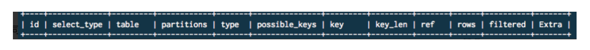

# Mysql

## Mysql的锁你了解哪些

按锁粒度分类:

1. 行锁:锁某行数据，锁粒度最小，并发度高
2. 表锁:锁整张表，锁粒度最大，并发度低
3. 间隙锁:锁的是一个区间

还可以分为:

1. 共享锁:也就是读锁，一个事务给某行数据加了读锁，其他事务也可以读，但是不能写
2. 排它锁:也就是写锁，一个事务给某行数据加了写锁，其他事务不能读，也不能写

还可以分为:

1. 乐观锁:并不会真正的去锁某行记录，而是通过一个版 本号来实现的
2. 悲观锁:上面所的行锁、表锁等都是悲观锁

在事务的隔离级别中，就需要利用锁来解决幻读


## Mysq|数据库中，什么情况下设置了索引但无法使用?

1. 没有符合最左前缀原则
2. 字段进行了隐式数据类型转化
3. 走索引没有全表扫描效率高

[https:/ /www .ilili.com/video/BV1W64y1u761?from=search&seid-6062298215110905390]()


## Innodb是如何实现事务的

Innodb通过Buffer Pool, LogBuffer, Redo Log, Undo Log来实现事务，以一个update语句为例:

1. Innodb在收到一个update语句后，会先根据条件找到数据所在的页，并将该页缓存在Buffer Pool中
2. 执行update语句，修改Buffer Pool中的数据，也就是内存中的数据
3. 针对update语句生成一个RedoLog对象， 并存入LogBuffer中
4. 针对update语句生成undolog日志，用于事务回滚
5. 如果事务提交，那么则把RedoLog对象进行持久化，后续还有其他机制将Buffer Pool中所修改的数据页持久化到磁盘中
6. 如果事务回滚，则利用undolog日志进行回滚


## 索引的基本原理

索引用来快速地寻找那些具有特定值的记录。如果没有索引，一般来说执行查询时遍历整张表。

索引的原理:就是把无序的数据变成有序的查询

1. 把创建了索引的列的内容进行排序
2. 对排序结果生成倒排表
3. 在倒排表内容上拼上数据地址链
4. 在查询的时候，先拿到倒排表内容，再取出数据地址链，从而拿到具体数据


## B树和B+树的区别，为什么Mysq|使用B+树

B树的特点:

1. 节点排序
2. 一个节点了可以存多个元素，多个元素也排序了

B+树的特点:

1. 拥有B树的特点
2. 叶子节点之间有指针
3. 非叶子节点上的元素在叶子节点上都冗余了，也就是叶子节点中存储了所有的元素，并且排好顺序


Mysql索引使用的是B+树，因为索引是用来加快查询的，而B+树通过对数据进行排序所以是可以提高查询速度的，然后通过一个节点中可以存储多个元素，从而可以使得B+树的高度不会太高，在MysqI中一个Innodb页就是一个B+树节点，一个Innodb页默认16kb，所以一般情况下一颗两层的B+树可以存2000万行左右的数据，然后通过利用B+树叶子节点存储了所有数据并且进行了排序,并且叶子节点之间有指针,可以很好的支持全表扫描，范围查找等SQL语句。


## mysql聚簇和非聚簇索引的区别

 都是B+树的数据结构

- 聚簇索引:将数据存储与索引放到了一块、并且是按照一定的顺序组织的，找到索引也就找到了数据，数据的物理存放顺序与索引顺序是一致的，即:只要索引是相邻的，那么对应的数据一定也是相邻地存放在磁盘上的

- 非聚簇索引:叶子节点不存储数据、存储的是数据行地址，也就是说根据索引查找到数据行的位置再取磁盘查找数据，这个就有点类似一本树的目录，比如我们要找第三章第一节，那我们先在这个目录里面找，找到对应的页码后再去对应的页码看文章。

  ```
  优势: 
  1、查询通过聚簇索引可以直接获取数据，相比非聚簇索引需要第二次查询(非覆盖索引的情况下)效率 要高
  2、聚簇索引对于范围查询的效率很高，因为其数据是按照大小排列的 
  3、聚簇索引适合用在排序的场合，非聚簇索引不适合
  
  劣势:
  1、维护索引很昂贵，特别是插入新行或者主键被更新导至要分页(page split)的时候。建议在大量插入新行后，选在负载较低的时间段，通过OPTIMIZE TABLE优化表，因为必须被移动的行数据可能造成 碎片。使用独享表空间可以弱化碎片 
  2、表因为使用UUId(随机ID)作为主键，使数据存储稀疏，这就会出现聚簇索引有可能有比全表扫面 更慢，所以建议使用int的auto_increment作为主键 
  3、如果主键比较大的话，那辅助索引将会变的更大，因为辅助索引的叶子存储的是主键值;过长的主键 值，会导致非叶子节点占用占用更多的物理空间
  ```

InnoDB中一定有主键，主键一定是聚簇索引，不手动设置、则会使用unique索引，没有unique索引， 则会使用数据库内部的一个行的隐藏id来当作主键索引。在聚簇索引之上创建的索引称之为辅助索引， 辅助索引访问数据总是需要二次查找，非聚簇索引都是辅助索引，像复合索引、前缀索引、唯一索引， 辅助索引叶子节点存储的不再是行的物理位置，而是主键值

MyISM使用的是非聚簇索引，没有聚簇索引，非聚簇索引的两棵B+树看上去没什么不同，节点的结构 完全一致只是存储的内容不同而已，主键索引B+树的节点存储了主键，辅助键索引B+树存储了辅助 键。表数据存储在独立的地方，这两颗B+树的叶子节点都使用一个地址指向真正的表数据，对于表数据 来说，这两个键没有任何差别。由于索引树是独立的，通过辅助键检索无需访问主键的索引树。

如果涉及到大数据量的排序、全表扫描、count之类的操作的话，还是MyISAM占优势些，因为索引所 占空间小，这些操作是需要在内存中完成的。


## mysql索引的数据结构，各自优劣

索引的数据结构和具体存储引擎的实现有关，在MySQL中使用较多的索引有Hash索引，B+树索引等， InnoDB存储引擎的默认索引实现为:B+树索引。对于哈希索引来说，底层的数据结构就是哈希表，因 此在**绝大多数需求为单条记录查询**的时候，可以选择哈希索引，查询性能最快;其余大部分场景，建议 选择BTree索引。


B+树:

B+树是一个平衡的多叉树，从根节点到每个叶子节点的高度差值不超过1，而且同层级的节点间有指针 相互链接。在B+树上的常规检索，从根节点到叶子节点的搜索效率基本相当，不会出现大幅波动，而且 基于索引的顺序扫描时，也可以利用双向指针快速左右移动，效率非常高。因此，B+树索引被广泛应用 于数据库、文件系统等场景。


哈希索引:

哈希索引就是采用一定的哈希算法，把键值换算成新的哈希值，检索时不需要类似B+树那样从根节点到 叶子节点逐级查找，只需一次哈希算法即可立刻定位到相应的位置，速度非常快


如果是等值查询，那么哈希索引明显有绝对优势，因为只需要经过一次算法即可找到相应的键值;前提 是键值都是唯一的。如果键值不是唯一的，就需要先找到该键所在位置，然后再根据链表往后扫描，直 到找到相应的数据;

如果是范围查询检索，这时候哈希索引就毫无用武之地了，因为原先是有序的键值，经过哈希算法后， 有可能变成不连续的了，就没办法再利用索引完成范围查询检索;

哈希索引也没办法利用索引完成排序，以及like ‘xxx%’ 这样的部分模糊查询(这种部分模糊查询，其实 本质上也是范围查询);

哈希索引也不支持多列联合索引的最左匹配规则;

B+树索引的关键字检索效率比较平均，不像B树那样波动幅度大，在有大量重复键值情况下，哈希索引 的效率也是极低的，因为存在哈希碰撞问题。


## 索引设计的原则?

查询更快、占用空间更小

1. 适合索引的列是出现在where子句中的列，或者连接子句中指定的列
2. 基数较小的表，索引效果较差，没有必要在此列建立索引
3. 使用短索引，如果对长字符串列进行索引，应该指定一个前缀长度，这样能够节省大量索引空间，如果搜索词超过索引前缀长度，则使用索引排除不匹配的行，然后检查其余行是否可能匹配。
4. 不要过度索引。索引需要额外的磁盘空间，并降低写操作的性能。在修改表内容的时候，索引会进行更新甚至重构，索引列越多，这个时间就会越长。所以只保持需要的索引有利于查询即可。
5. 定义有外键的数据列一定要建立索引。
6. 更新频繁字段不适合创建索引
7. 若是不能有效区分数据的列不适合做索引列(如性别，男女未知，最多也就三种，区分度实在太低)

1. 尽量的扩展索引，不要新建索引。比如表中已经有a的索引，现在要加(a,b)的索引，那么只需要修 改原来的索引即可。

1. 对于那些查询中很少涉及的列，重复值比较多的列不要建立索引。 
2. 对于定义为text、image和bit的数据类型的列不要建立索引。


## 什么是最左前缀原则?什么是最左匹配原则


## 锁的类型有哪些

基于锁的属性分类:共享锁、排他锁。

基于锁的粒度分类:行级锁(INNODB)、表级锁(INNODB、MYISAM)、页级锁(BDB引擎 )、记录锁、间 隙锁、临键锁。

基于锁的状态分类:意向共享锁、意向排它锁。 


- 共享锁(Share Lock)
  - 共享锁又称读锁，简称S锁;当一个事务为数据加上读锁之后，其他事务只能对该数据加读锁，而不能对 数据加写锁，直到所有的读锁释放之后其他事务才能对其进行加持写锁。共享锁的特性主要是为了支持 并发的读取数据，读取数据的时候不支持修改，避免出现重复读的问题。
- 排他锁(eXclusive Lock)
  - 排他锁又称写锁，简称X锁;当一个事务为数据加上写锁时，其他请求将不能再为数据加任何锁，直到该 锁释放之后，其他事务才能对数据进行加锁。排他锁的目的是在数据修改时候，不允许其他人同时修 改，也不允许其他人读取。避免了出现脏数据和脏读的问题。
- 表锁
  - 表锁是指上锁的时候锁住的是整个表，当下一个事务访问该表的时候，必须等前一个事务释放了锁才能进行对表进行访问;
  - 特点: 粒度大，加锁简单，容易冲突;
- 行锁
  - 行锁是指上锁的时候锁住的是表的某一行或多行记录，其他事务访问同一张表时，只有被锁住的记录不能访问，其他的记录可正常访问
  - 特点:粒度小，加锁比表锁麻烦，不容易冲突，相比表锁支持的并发要高
- 记录锁(Record Lock)
  - 记录锁也属于行锁中的一种，只不过记录锁的范围只是表中的某一条记录，记录锁是说事务在加锁后锁住的只是表的某一条记录。
  - 精准条件命中，并且命中的条件字段是唯一索引
  - 加了记录锁之后数据可以避免数据在查询的时候被修改的重复读问题，也避免了在修改的事务未提交前被其他事务读取的脏读问题。
- 页锁
  - 页级锁是MySQL中锁定粒度介于行级锁和表级锁中间的一种锁。表级锁速度快，但冲突多，行级冲突 少，但速度慢。所以取了折衷的页级，一次锁定相邻的一组记录。 特点:开销和加锁时间界于表锁和行锁之间;会出现死锁;锁定粒度界于表锁和行锁之间，并发度一般
- 间隙锁(Gap Lock)
  - 属于行锁中的一种，间隙锁是在事务加锁后其锁住的是表记录的某一个区间，当表的相邻ID之间出现空 隙则会形成一个区间，遵循左开右闭原则。
  - 范围查询并且查询未命中记录，查询条件必须命中索引、间隙锁只会出现在REPEATABLE_READ(重复 读)的事务级别中。 触发条件:防止幻读问题，事务并发的时候，如果没有间隙锁，就会发生如下图的问题，在同一个事务 里，A事务的两次查询出的结果会不一样。
  - 比如表里面的数据ID 为 1,4,5,7,10 ,那么会形成以下几个间隙区间，-n-1区间，1-4区间，7-10 区间，10-n区间 (-n代表负无穷大，n代表正无穷大)
- 临建锁(Next-Key Lock)
  - 也属于行锁的一种，并且它是INNODB的行锁默认算法，总结来说它就是记录锁和间隙锁的组合，临键锁 会把查询出来的记录锁住，同时也会把该范围查询内的所有间隙空间也会锁住，再之它会把相邻的下一 个区间也会锁住
  - 触发条件:范围查询并命中，查询命中了索引。 
  - 结合记录锁和间隙锁的特性，临键锁避免了在范围查询时出现脏读、重复读、幻读问题。加了临键锁之 后，在范围区间内数据不允许被修改和插入。


如果当事务A加锁成功之后就设置一个状态告诉后面的人，已经有人对表里的行加了一个排他锁 了，你们不能对整个表加共享锁或排它锁了，那么后面需要对整个表加锁的人只需要获取这个状态 就知道自己是不是可以对表加锁，避免了对整个索引树的每个节点扫描是否加锁，而这个状态就是 意向锁。

- 意向共享锁
  - 当一个事务试图对整个表进行加共享锁之前，首先需要获得这个表的意向共享锁。 

- 意向排他锁							 		
  - 当一个事务试图对整个表进行加排它锁之前，首先需要获得这个表的意向排它锁。


## InnoDB存储引擎的锁的算法

- Record lock:单个行记录上的锁
- Gap lock:间隙锁，锁定一个范围，不包括记录本身 
- Next-key lock:record+gap 锁定一个范围，包含记录本身

相关知识点：

1. innodb对于行的查询使用next-key lock

1. Next-locking keying为了解决Phantom Problem幻读问题

1. 当查询的索引含有唯一属性时，将next-key lock降级为record key

1. Gap锁设计的目的是为了阻止多个事务将记录插入到同一范围内，而这会导致幻读问题的产生

1. 有两种方式显式关闭gap锁：（除了外键约束和唯一性检查外，其余情况仅使用record lock） 
   1. 将事务隔离级别设置为RC
   2. 将参数innodb_locks_unsafe_for_binlog设置为1

 


## 关心过业务系统里面的sql耗时吗？统计过慢查询吗？对慢查询都怎么优化过？

在业务系统中，除了使用主键进行的查询，其他的都会在测试库上测试其耗时，慢查询的统计主要由运维在做，会定期将业务中的慢查询反馈给我们。

慢查询的优化首先要搞明白慢的原因是什么？是查询条件没有命中索引？是load了不需要的数据列？还是数据量太大？

所以优化也是针对这三个方向来的，

- 首先分析语句，看看是否load了额外的数据，可能是查询了多余的行并且抛弃掉了，可能是加载了许多结果中并不需要的列，对语句进行分析以及重写。

- 分析语句的执行计划，然后获得其使用索引的情况，之后修改语句或者修改索引，使得语句可以尽可能的命中索引。

- 如果对语句的优化已经无法进行，可以考虑表中的数据量是否太大，如果是的话可以进行横向或者纵向的分表。


## 事务的基本特性和隔离级别

事务基本特性ACID分别是：

**原子性**指的是一个事务中的操作要么全部成功，要么全部失败。

**一致性**指的是数据库总是从一个一致性的状态转换到另外一个一致性的状态。比如A转账给B100块钱，假设A只有90块，支付之前我们数据库里的数据都是符合约束的,但是如果事务执行成功了,我们的数据库数据就破坏约束了,因此事务不能成功,这里我们说事务提供了一致性的保证**隔离性**指的是一个事务的修改在 终提交前，对其他事务是不可见的。

**持久性**指的是一旦事务提交，所做的修改就会永久保存到数据库中。

 

隔离性有4个隔离级别，分别是：

- read uncommit 读未提交，可能会读到其他事务未提交的数据，也叫做脏读。
  - 用户本来应该读取到id=1的用户age应该是10，结果读取到了其他事务还没有提交的事务，结果读取结果age=20，这就是脏读。
- read commit 读已提交，两次读取结果不一致，叫做不可重复读。
  - 不可重复读解决了脏读的问题，他只会读取已经提交的事务。
  - 用户开启事务读取id=1用户，查询到age=10，再次读取发现结果=20，在同一个事务里同一个查询读取到不同的结果叫做不可重复读。
- repeatable read 可重复复读，这是mysql的默认级别，就是每次读取结果都一样，但是有可能产生幻读。
- serializable 串行，一般是不会使用的，他会给每一行读取的数据加锁，会导致大量超时和锁竞争的问题。

 

脏读(Drity Read)：某个事务已更新一份数据，另一个事务在此时读取了同一份数据，由于某些原因，前一个RollBack了操作，则后一个事务所读取的数据就会是不正确的。

不可重复读(Non-repeatable read):在一个事务的两次查询之中数据不一致，这可能是两次查询过程中间插入了一个事务更新的原有的数据。

幻读(Phantom Read):在一个事务的两次查询中数据笔数不一致，例如有一个事务查询了几列(Row)数据，而另一个事务却在此时插入了新的几列数据，先前的事务在接下来的查询中，就会发现有几列数据是它先前所没有的。


## ACID靠什么保证的？

A原子性由undo log日志保证，它记录了需要回滚的日志信息，事务回滚时撤销已经执行成功的sql

C一致性由其他三大特性保证、程序代码要保证业务上的一致性

I隔离性由MVCC来保证

D持久性由内存+redo log来保证，mysql修改数据同时在内存和redo log记录这次操作，宕机的时候可以从redo log恢复

```
InnoDB redo log 写盘，InnoDB 事务进入 prepare 状态。

如果前面 prepare 成功，binlog 写盘，再继续将事务日志持久化到 binlog，如果持久化成功，那么

InnoDB 事务则进入 commit 状态(在 redo log 里面写一个 commit 记录)
```

redolog的刷盘会在系统空闲时进行

redo log和bin log都可以用做数据恢复，bin log是mySql server层面上的，从服务器可以通过bin log来进行与主服务器的数据同步。


## 什么是MVCC                                           

多版本并发控制：读取数据时通过一种类似快照的方式将数据保存下来，这样读锁就和写锁不冲突了，不同的事务session会看到自己特定版本的数据，版本链

MVCC只在 READ COMMITTED 和 REPEATABLE READ 两个隔离级别下工作。其他两个隔离级别够和MVCC不兼容, 因为 READ UNCOMMITTED 总是读取 新的数据行, 而不是符合当前事务版本的数据行。而 SERIALIZABLE 则会对所有读取的行都加锁。

 

聚簇索引记录中有两个必要的隐藏列： 

**trx_id**：用来存储每次对某条聚簇索引记录进行修改的时候的事务id。

**roll_pointer**：每次对哪条聚簇索引记录有修改的时候，都会把老版本写入undo日志中。这个 roll_pointer就是存了一个指针，它指向这条聚簇索引记录的上一个版本的位置，通过它来获得上一个版本的记录信息。(注意插入操作的undo日志没有这个属性，因为它没有老版本) 

**已提交读和可重复读的区别就在于它们生成ReadView的策略不同**。


开始事务时创建readview，readView维护当前活动的事务id，即未提交的事务id，排序生成一个数组

访问数据，获取数据中的事务id（获取的是事务id大的记录），对比readview：

如果在readview的左边（比readview都小），可以访问（在左边意味着该事务已经提交）（即数据中的事务id比readview中的活动事务的id都小，即该事务已经提交，不处于活动状态）

如果在readview的右边（比readview都大）或者就在readview中，不可以访问，获取roll_pointer，取上一版本重新对比（在右边意味着，该事务在readview生成之后出现，在readview中意味着该事务还未提交）

 

已提交读隔离级别下的事务在每次查询的开始都会生成一个独立的ReadView,而可重复读隔离级别则在第一次读的时候生成一个ReadView，之后的读都复用之前的ReadView。

这就是Mysql的MVCC,通过版本链，实现多版本，可并发读-写，写-读。通过ReadView生成策略的不同实现不同的隔离级别。

 

 

 

 

 

## 分表后非sharding_key的查询怎么处理，分表后的排序？

1. 可以做一个mapping表，比如这时候商家要查询订单列表怎么办呢？不带user_id查询的话你总不能扫全表吧？所以我们可以做一个映射关系表，保存商家和用户的关系，查询的时候先通过商家查询到用户列表，再通过user_id去查询。

1. 宽表，对数据实时性要求不是很高的场景，比如查询订单列表，可以把订单表同步到离线（实时）数仓，再基于数仓去做成一张宽表，再基于其他如es提供查询服务。

1. 数据量不是很大的话，比如后台的一些查询之类的，也可以通过多线程扫表，然后再聚合结果的方式来做。或者异步的形式也是可以的。

 

union

排序字段是唯一索引：

- 首先第一页的查询：将各表的结果集进行合并，然后再次排序
- 第二页及以后的查询，需要传入上一页排序字段的 后一个值，及排序方式。
- 根据排序方式，及这个值进行查询。如排序字段date，上一页 后值为3，排序方式降序。查询的时候sql为select ... from table where date < 3 order by date desc limit 0,10。这样再将几个表的结果合并排序即可。

  

## mysql主从同步原理                             

mysql主从同步的过程：

Mysql的主从复制中主要有三个线程：master（binlog dump thread）、slave（I/O thread 、SQL thread），Master一条线程和Slave中的两条线程。

- 主节点 binlog，主从复制的基础是主库记录数据库的所有变更记录到 binlog。binlog 是数据库服务器启动的那一刻起，保存所有修改数据库结构或内容的一个文件。
- 主节点 log dump 线程，当 binlog 有变动时，log dump 线程读取其内容并发送给从节点。
- 从节点 I/O线程接收 binlog 内容，并将其写入到 relay log 文件中。
- 从节点的SQL 线程读取 relay log 文件内容对数据更新进行重放， 终保证主从数据库的一致性。

注：主从节点使用 binglog 文件 + position 偏移量来定位主从同步的位置，从节点会保存其已接收到的偏移量，如果从节点发生宕机重启，则会自动从 position 的位置发起同步。（增量同步，而不是全量同步）

 

由于mysql默认的复制方式是异步的，主库把日志发送给从库后不关心从库是否已经处理，这样会产生一个问题就是假设主库挂了，从库处理失败了，这时候从库升为主库后，日志就丢失了。由此产生两个概念。

**全同步复制**

主库写入binlog后强制同步日志到从库，所有的从库都执行完成后才返回给客户端，但是很显然这个方式的话性能会受到严重影响。

**半同步复制**

和全同步不同的是，半同步复制的逻辑是这样，从库写入日志成功后返回ACK确认给主库，主库收到至少一个从库的确认就认为写操作完成。

 

## 简述MyISAM和InnoDB的区别                   

**MyISAM：**

不支持事务，但是每次查询都是原子的；

支持表级锁，即每次操作是对整个表加锁；

存储表的总行数；

一个MYISAM表有三个文件：索引文件、表结构文件、数据文件；

采用非聚集索引，索引文件的数据域存储指向数据文件的指针。辅索引与主索引基本一致，但是辅索引不用保证唯一性。

**InnoDb：**

支持ACID的事务，支持事务的四种隔离级别；

支持行级锁及外键约束：因此可以支持写并发；

不存储总行数；

一个InnoDb引擎存储在一个文件空间（共享表空间，表大小不受操作系统控制，一个表可能分布在多个文件里），也有可能为多个（设置为独立表空，表大小受操作系统文件大小限制，一般为2G），受操作系统文件大小的限制；

主键索引采用聚集索引（索引的数据域存储数据文件本身），辅索引的数据域存储主键的值；因此从辅索引查找数据，需要先通过辅索引找到主键值，再访问辅索引； 好使用自增主键，防止插入数据时，为维持B+树结构，文件的大调整。 

 

## 简述mysql中索引类型及对数据库的性能的影响        

普通索引：允许被索引的数据列包含重复的值。

唯一索引：可以保证数据记录的唯一性。

主键：是一种特殊的唯一索引，在一张表中只能定义一个主键索引，主键用于唯一标识一条记录，使用关键字 PRIMARY KEY 来创建。

联合索引：索引可以覆盖多个数据列，如像INDEX(columnA, columnB)索引。

全文索引：通过建立倒排索引 ,可以极大的提升检索效率,解决判断字段是否包含的问题，是目前搜索引擎使用的一种关键技术。可以通过ALTER TABLE table_name ADD FULLTEXT (column);创建全文索引

 

索引可以极大的提高数据的查询速度。

通过使用索引，可以在查询的过程中，使用优化隐藏器，提高系统的性能。

但是会降低插入、删除、更新表的速度，因为在执行这些写操作时，还要操作索引文件

索引需要占物理空间，除了数据表占数据空间之外，每一个索引还要占一定的物理空间，如果要建立聚簇索引，那么需要的空间就会更大，如果非聚集索引很多，一旦聚集索引改变，那么所有非聚集索引都会跟着变。

 

 

## mysql执行计划怎么看                           

执行计划就是sql的执行查询的顺序，以及如何使用索引查询，返回的结果集的行数

EXPLAIN SELECT * from A where X=? and Y=?



1. id ：是一个有顺序的编号，是查询的顺序号，有几个 select 就显示几行。id的顺序是按 select 出现的顺序增长的。id列的值越大执行优先级越高越先执行，id列的值相同则从上往下执行，id列的值为NULL后执行。

1. selectType 表示查询中每个select子句的类型
   - SIMPLE： 表示此查询不包含 UNION 查询或子查询
   - PRIMARY： 表示此查询是 外层的查询（包含子查询）
   - SUBQUERY： 子查询中的第一个 SELECT
   - UNION： 表示此查询是 UNION 的第二或随后的查询
   - DEPENDENT UNION： UNION 中的第二个或后面的查询语句, 取决于外面的查询
   - UNION RESULT, UNION 的结果
   - DEPENDENT SUBQUERY: 子查询中的第一个 SELECT, 取决于外面的查询. 即子查询依赖于外层查询的结果.
   - DERIVED：衍生，表示导出表的SELECT（FROM子句的子查询）

1. table：表示该语句查询的表

1. type：优化sql的重要字段，也是我们判断sql性能和优化程度重要指标。他的取值类型范围
   - const：通过索引一次命中，匹配一行数据 
   - system: 表中只有一行记录，相当于系统表； 
   - eq_ref：唯一性索引扫描，对于每个索引键，表中只有一条记录与之匹配 
   - ref: 非唯一性索引扫描,返回匹配某个值的所有
   - range: 只检索给定范围的行，使用一个索引来选择行，一般用于between、<、>； 
   - index: 只遍历索引树；
   - ALL: 表示全表扫描，这个类型的查询是性能 差的查询之一。 那么基本就是随着表的数量增多，执行效率越慢。

**执行效率：**

**ALL < index < range< ref < eq_ref < const < system。最好是避免ALL和index**

1. possible_keys：它表示Mysql在执行该sql语句的时候，可能用到的索引信息，仅仅是可能，实际不一定会用到。

1. key：此字段是 mysql 在当前查询时所真正使用到的索引。 他是possible_keys的子集

1. key_len：表示查询优化器使用了索引的字节数，这个字段可以评估组合索引是否完全被使用，这也是我们优化sql时，评估索引的重要指标

1. rows：mysql 查询优化器根据统计信息，估算该sql返回结果集需要扫描读取的行数，这个值相关重要，索引优化之后，扫描读取的行数越多，说明索引设置不对，或者字段传入的类型之类的问题，说明要优化空间越大

1. filtered：返回结果的行占需要读到的行(rows列的值)的百分比，就是百分比越高，说明需要查询到数据越准确， 百分比越小，说明查询到的数据量大，而结果集很少

1. extra
   - using filesort ：表示 mysql 对结果集进行外部排序，不能通过索引顺序达到排序效果。一般有 using filesort都建议优化去掉，因为这样的查询 cpu 资源消耗大，延时大。
   - using index：覆盖索引扫描，表示查询在索引树中就可查找所需数据，不用扫描表数据文件，往往说明性能不错。
   - using temporary：查询有使用临时表, 一般出现于排序， 分组和多表 join 的情况， 查询效率不高，建议优化。
   - using where ：sql使用了where过滤,效率较高。